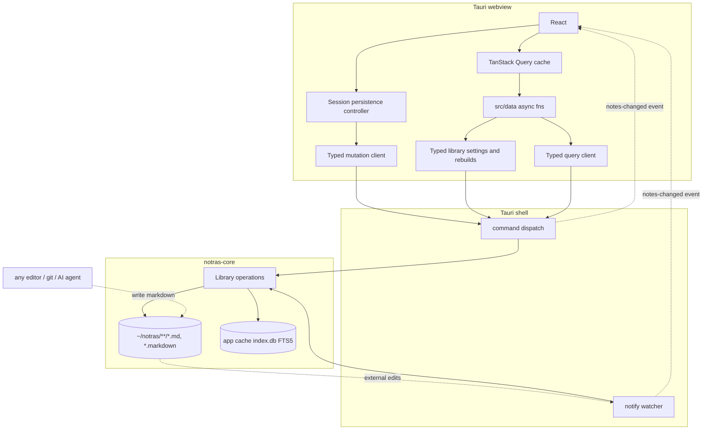

# ARCHITECTURE

How notras is built. `AGENTS.md` maps the rest of the docs.

## Tech stack

| Layer | Choice |
| --- | --- |
| Shell | Tauri 2 (Rust): command dispatch, notify watcher, tray, global shortcuts |
| Frontend | Vite + React 19 (no SSR), compiled by the React Compiler through `oxc-transform-react` (`D82`); TanStack Query caches every read (`D66`); `react-error-boundary` over the workspace (`D81`) |
| Editor | TipTap 3 WYSIWYG + official `@tiptap/markdown` (bidirectional GFM); Shiki code blocks; ⌘E raw-source view |
| Note engine | `notras-core`: files through `cap-std` directory handles, Markdown interpretation, `rusqlite` index and typed operations |
| Native contract | Pinned Specta types and Tauri commands/events; Serde wire values and thiserror failures |
| UI | Shadcn UI (base-nova style on Base UI) + Tailwind CSS 4, with the Blackout theme defined in `src/styles.css` |
| Note surface | shadcn/typeset, vendored verbatim; tuned through the `.typeset-note` preset (`D40`) |
| Lint + format | Ultracite on oxlint and oxfmt for JS/TS; rustfmt and Clippy for Rust |
| Testing | Vitest + Testing Library + happy-dom (TS), `cargo test` with cargo-llvm-cov reports (Rust) |
| Package manager | pnpm |

## Linux runtime

Linux support follows the Ubuntu release of GitHub Actions' `ubuntu-latest` runner, with current system updates. Tauri uses the distribution's WebKitGTK, so frontend built-ins must work in that runtime, and fallbacks for older Ubuntu releases and other distributions are outside the support policy.

## Files are the source of truth

Notes are `.md` or `.markdown` files under the notes dir (default `~/notras`). Folders are directories. `Library::open` resolves the selected root, including a root symlink, and the shell uses that resolved path for watching and attachment access. `pinned` and `tags` live in YAML frontmatter. The SQLite index lives outside the library, at `app_cache_dir()/index/<sha256 of the resolved root>/index.db`, and is derived and disposable. Library IO opens the resolved root as a directory handle and walks folders without following symlinks, so a path validated once cannot be redirected before its operation runs.



**Rust is the single writer of the index.** Rust publishes complete documents, allocates filenames without overwriting another note, and reconciles the index under the library lock. The editing session owns changes to the document. Committed bytes remain successful when index reconciliation fails. Commands emit affected paths after releasing the lock.

**External writers** (AI agents, other editors, git) are reconciled by the debounced watcher. The mtime skip in `index_file` keeps self-writes from echoing. UI refresh is event-driven: `layout.tsx` listens for `notes-changed` and invalidates the query keys the event names, so only the tabs holding a changed file re-read (`D66`).

**The index is disposable.** `ensure_schema` creates the tables and FTS5 on startup, so deleting the cached `index.db` triggers a rebuild. `PRAGMA user_version` carries `SCHEMA_VERSION`. Opening an older index recreates its tables and advances the version in one transaction. The startup scan then derives every row from the saved files, including unchanged notes.

Index reconciliation propagates SQLite read and decoding failures. Only a missing note row counts as an absent stored timestamp. A scan reads all indexed paths successfully before deleting stale entries. Removing one note's rows from the note, tag, link and search tables uses one transaction; a failed deletion rolls back that note's index changes. A scan records per-file path conversion failures and continues processing valid files. Any such failure defers all stale-row cleanup because the scan cannot reliably match every existing file to its indexed path. Cleanup resumes on a scan without conversion failures. A scan can retain successful work on other notes before a later failure.

**A rebuild retains usable rows while refreshing them.** Forced scans bypass the mtime skip and replace each note's derived rows in one transaction. Normal scans still skip unchanged files. Cleanup validates all indexed paths before deleting any stale rows, then checks each candidate against the current filesystem. A foreground create or move after enumeration cannot be mistaken for a deletion.

**Note identity is the relative path.** Renames are delete plus create in the index. Wikilinks resolve by title and then by filename stem, so a retitle can dangle links, a consequence `D5` accepts. Rust resolves saved relationships in `relationships.rs`; `linkResolver` in `src/core/links.ts` resolves editor clicks.

**Readable content supplies the name.** Library notes, capture, and external tabs resolve a leading heading, then the first readable body line, then imported frontmatter `title:`, then the filename stem. Marked and pulldown-cmark extract readable source lines with matching cases in `fixtures/note-titles.json`. Extraction skips code, images, HTML blocks and tables, removes formatting, and preserves the source document. Creation without an explicit name uses the same title and native filename sanitizer; an empty title falls back to `untitled`. Existing frontmatter titles remain verbatim.

**Only an in-app title-source edit requests a derived filename.** Editor transactions report edits to that source, including edits whose final text is unchanged. A frontmatter title supplies the name only when no readable body line exists. Rename edits the live heading and introduces it when absent. Rust recomputes the available filename for each naming request. Removing a title source falls through to the next content title; without one, the filename stays. Reads, searches, reindexing, and external observations do not request renaming. Undo restores the content and its associated filename; an occupied destination receives a suffix.

**Frontmatter has two parsers.** TypeScript parses and edits the live document; Rust parses persisted documents for indexing. Both interpret `pinned`, `tags`, and imported `title` values. Pin and tag controls update the session document, preserving unknown fields and the closing delimiter. They share its history and persistence with source edits.

## Index schema

Rust owns the tables and their queries. The webview sends structured filters and receives typed results; it holds no schema mirror or SQL builder.

```sql
note(id INTEGER PK, path TEXT NOT NULL UNIQUE, title TEXT, folder TEXT, pinned INT, created_at INT, updated_at INT, body_line_offset INT)
note_tag(path TEXT, tag TEXT, PRIMARY KEY(path, tag))
note_prose_fallback(path TEXT PK)  -- bodies requiring literal phrase scanning
note_link(path TEXT, line INT, kind TEXT, target TEXT, context TEXT)  -- one row per link destination, kind distinguishing wikilink, link, and destination, indexed by path
note_fts(path UNINDEXED, title, content)  -- fts5, unicode61; bm25 + snippet() + highlight()
```

`note.id` is an internal SQLite key, shared with `note_fts.rowid`. It remains stable through note updates and database compaction. Paths remain note identity outside the index. Updates and deletes address FTS rows through this key; deleting a note removes its FTS entry before its key disappears, within the same transaction. The body remains in FTS, so prose queries do not duplicate document storage.

`queries.rs` owns FTS normalization, AND-prefix matching, exact-title and title-hit tiers over pin and BM25 ordering, 8-token snippets and highlighted titles. The exact tier compares with SQLite's ASCII `lower()`. Ranking joins FTS to notes by the integer key. All search filters intersect before the 30-result cap. Result hydration loads metadata, tags and snippets after that cap; filter evaluation separately reads library metadata for membership and relationship resolution. `src/core/fts-markers.ts` carries the matching display markers. FTS snippets take precedence over filter context; otherwise the first filter that supplies context wins. Tag reads use insertion order to preserve frontmatter order. Displayed note groups sort locale-aware in the frontend, duplicate-title resolution uses Unicode scalar path ordering, and folder hubs use JavaScript string ordering.

`note_link` stores destinations; graph reads select only `wikilink` and `link` kinds. A row is one `[[...]]` as the file holds it: `line` counts from the top of the file so `grep -n` agrees, `kind` is `wikilink`, `link`, or `destination`; `link` is for a `[text](note.md)` whose destination `is_note_path` accepts, `target` is the text between the brackets or the destination as written, and `context` is the line. Nothing in the row is resolved. `is_note_path` accepts a destination with no scheme that is not an anchor or an absolute path and ends in `.md` or `.markdown`, in any case, before any `#` or `?`. A wikilink inside a fence, indented code, inline code, an HTML block or comment, or between a matching pair of inline tags is not a row, and the editor shows text rather than a pill there. Images and links inside code or an HTML pair are not rows either, and a malformed or escaped wikilink opening does not suppress a rendered autolink.

`relationships.rs` resolves a target on read, a wikilink by title and a link by path relative to the note, so a note created after the link was written is still found and a retitle can dangle a link (`D5`), and groups the rows that resolve to a note by the note they come from. The scanner in `markdown.rs` records rendered destinations: pulldown-cmark decides what is code, HTML, or a link destination, and a byte mask over the body carries the rest.

A title written bare is not a row, because it depends on another note's title, which the file being indexed cannot know. `find_mentions` finds those in indexed bodies on read: FTS and `note_prose_fallback` name candidates for a note reference, excluding the current note from both sets, and the same mask decides which occurrences are prose. The body line supplying a candidate note's title is excluded from bare mentions. The `mention:` search filter requests an arbitrary phrase, including headings. Mention requests take only a path; Rust reads the target title from the index. ASCII phrases with letters or digits use FTS candidates plus files with non-ASCII bodies; punctuation-only and non-ASCII phrases scan the indexed bodies. Prose reads join FTS content to `note.body_line_offset`, preserving original file line numbers in the same snapshot as titles, tags and explicit links. External edits reach those queries after indexing; query execution never reopens a candidate file.

`note_prose_fallback` stores paths for non-ASCII and NUL-containing bodies. Indexing maintains those paths in the same transaction as FTS. It avoids reading each stored body on every candidate lookup. This retains matches that `unicode61` can miss because its Unicode case folding and word boundaries differ from the literal scanner. Bare GFM autolinks are recognized within eligible prose and excluded from phrase spans. Autolink scanning masks explicit link spans once and advances through precomputed wikilinks, skipping a wikilink only at its opening offset.

## Project structure

```txt
src/
  main.tsx, app.tsx   # Vite entry and the query client; ?window=capture branches to the capture window
  layout.tsx          # the main window: error boundary, palette, settings dialog, hotkeys, notes-changed listener (D81)
  styles.css          # Tailwind 4 theme, fonts, editor and titlebar styling
  typeset.css         # shadcn/typeset, vendored verbatim (D40); do not edit
  components/         # UI, one folder per surface; ui/ is owned shadcn (D85)
  core/               # isomorphic bottom layer, no platform imports
  data/               # plain async fns the UI calls, one concern per file; queries.ts owns the query keys (D66)
  server/adapters/    # bindings.ts, the GENERATED native commands, events and wire types
  lib/                # client utilities
crates/notras-core/   # the engine: files, index, typed operations
src-tauri/            # the shell: dispatch, watcher, tray, windows, scan coordination;
                      # windows.rs holds the window command because a command cannot live in lib.rs
  icons/              # GENERATED by scripts/icons.sh
assets/               # raster desktop master, shared SVG master, GENERATED hero
public/               # GENERATED favicons, touch icon, and welcome marks
scripts/              # bindings.sh, icons.sh (macOS only), update-typeset.sh (D40)
.github/homebrew/     # the cask template release.yml renders and pushes to the tap
```

`scripts/icons.sh` owns icon generation. It selects the raster desktop master above 64 logical pixels and otherwise derives size-adjusted artwork from the shared SVG, then produces the desktop PNGs, ICNS, and ICO under `src-tauri/icons/`. The tray derives a monochrome silhouette with transparent cutouts from the same SVG. Scheme-aware welcome marks and favicons, the dark touch icon, and the README hero are generated in the locations above. Artwork lighting and rear-note colors live in the masters and script; interface colors come from `src/styles.css`. `README.md` lists the source-to-output workflow and required tools.

## Layer boundaries

Nothing enforces these. Lint held them until `D41` retired the ESLint config, and `D43` records why they were not ported to the preset. Review is the check now, and the fix for a violation is never to move the import.

- **`src/core/**` is isomorphic.** No `@tauri-apps/*`, `react`, `react-dom`, or `node:*`, and no upward imports from `@/server`, `@/lib`, `@/components`, or `@/data`. It runs in the webview and in any other runtime, which is what makes it testable without a window.
- **The `notras-core` crate is window-free.** Its `Library` privately owns the library directory, SQLite connection and index health. The shell calls operations and cannot manipulate index state. `notes.rs` supplies the blocking task and library lock. Library settings and rebuilds use the same typed command boundary through `src/data`. Native bindings live in `src/server/adapters/**`.
- **UI code** (`src/components`, `src/layout.tsx`, `src/lib`) may use `@tauri-apps/*` for UI concerns: events, dialogs, window control. Note file IO and indexed reads go through `src/data`.

## Key patterns

### Data access

The UI calls plain async functions in `src/data/`, one concern per file. Queries, mutations, library settings and reindexing call generated operation commands through `nativeCommand`; Rust owns persisted metadata, filters and relationship resolution. `nativeCommand` converts expected native rejections and Tauri argument-decoding strings into `FileError`, a plain `Error` subclass with a `failed` or `not-found` kind and the original cause. The caller supplies the action and displays the reason. Unexpected defects go to the log through `tauri-plugin-log`, and the caller sees "an unexpected error" even if logging fails.

Reads reach those functions through TanStack Query. `src/data/queries.ts` owns note query keys. Open-note actions use the loaded session. The palette and the tag controls read its live snapshot. Every metadata edit, a pin flip or a tag change, is a function of the document's current frontmatter, applied when it runs. The combobox translates its rendered selection event into toggled tags at the control boundary. This preserves intervening edits before a rerender or save completes, including adding and then removing the same tag. One persistence queue saves complete documents and orders folder moves; query results cannot acknowledge an edit.

### Test seam

React tests run through Testing Library in happy-dom. `vitest.setup.ts` registers DOM matchers, the React act environment, and cleanup without enabling Vitest globals. Editor history and persistence tests use the real Tiptap engine. The happy-dom environment does not establish native IME behavior, layout, or selection feel.

Query tests use real SQLite and temporary note directories. Recorded fixtures pin graph, mention and filter behavior. Shared resolver fixtures run in Rust and TypeScript, including malformed percent encodings and duplicate titles. React tests fake the IPC boundary while using the real query adapters and cache.

Rust engine tests run independently with `cargo test -p notras-core --locked`. The engine exposes `Library` operations without an `AppHandle` or window dependency. Its optional `bindings` feature adds Specta metadata and is enabled by the shell. Tauri handlers run blocking work through `spawn_blocking` and obtain a library guard inside that task. A guard never crosses an `await`. Blocking tasks own decoded IPC inputs for their lifetime.

State access panics if its mutex is poisoned; it does not expose potentially interrupted state. Blocking-task panics resume unwinding with their original payload. Non-panic task failures remain command errors. Release builds abort on panic.

The IPC tests use Tauri's test runtime with the production command registry, temporary directories and real SQLite. Index failures are injected through a separate database connection; the shell has no access to the engine connection. They send JSON requests through Tauri's argument decoder and check serialized receipts, failures and events. They do not exercise an OS webview, tray or clipboard. Mutation receipts carry the committed path, its content revision, timestamp and warnings, and every direct read carries the revision of the bytes it returned. Path receipts also carry committed content and any remaining source. Data functions convert timestamps to `Date`. Controller tests supply persistence functions; mounted session tests exercise the real editor, tab store and query cache over the IPC boundary.

### The session owns the document

`note-document.ts` owns a Tiptap source editor whose single code block holds the complete Markdown document and ProseMirror history. The source view mounts onto that editor. Detaching it retains the document and history while removing view plugins, so rich edits do not run source highlighting. Rich mode projects the body and delegates edits, selections, undo, and redo to the same document. Mapping a rich selection to source offsets is optional: failed conversion omits the selection without suppressing a valid document edit. Restoring source offsets during a rich replacement is also optional: a mapping failure retains the transaction-mapped selection and still dispatches the replacement. Parsing the replacement itself remains fallible. Rename and metadata actions enter the same history. A filename history entry identifies the result of its action, including a native collision suffix; a new title-source edit creates a fresh naming request. Editor callbacks are fixed at mount and read current session values through stable functions.

Both editor handles expose a `FindHandle` backed by the shared Tiptap `Find` extension. The extension maps text-block character offsets to ProseMirror positions, including atomic wikilink titles, and decorates matches without document changes or undo entries. A selection bookmark tracks the prior caret through edits.

`createFindController` binds one active editor handle and releases its subscription and highlights on handoff. The workspace owns one controller, and capture owns another. Their query and open state remain in memory. Sessions bind handles; the window owns shortcuts and the floating `FindBar`. A hidden or destroyed editor cannot receive navigation.

The main window suspends on the library directory and the startup query together. The startup query, `src/data/restore-session.ts`, restores saved tabs once per launch: `staleTime: "static"` and an infinite `gcTime` keep a fulfilled result from ever refetching, and the error screen's retry refetches a rejected one (`D81`). When there are none, `RecentNote` owns the optional latest-note query and its completion state. Its opening request applies only while the tab state still matches startup. Sessions observe the note list without suspending their document, history or persistence. Title suggestions and link hover resolution become available when the list arrives. A link activation without a loaded list awaits resolution and reports a failed read instead of claiming the destination is missing. Each activation supersedes the preceding one. Switching away from the originating tab or disposing its session cancels the pending action, so returning cannot revive it. Changes that leave the originating tab active do not cancel the action. Attached tag chips and typed tag choices use the live document while the counted vocabulary loads. `RecentNote` and palette search read `indexStatusQuery`, primed by `index_status` and updated by the `index-status` event, to label a wait on the first scan.

### Rich and source editing

The rich editor projects the body; source mode projects the complete Markdown. Both update one session document, and every save sends that complete document. The session counts edits and retains only the count it sent until acknowledgement, so newer edits remain dirty. It also retains its base, the file version its edits started from, which each save receipt, clean adoption, merge and folder move replace. A receipt updates the committed path, timestamp and base without replacing live text.

### Markdown round-trip contract

`markdown-roundtrip.spec.ts` pins the set of constructs that must survive file to editor to file. Extend it when adding nodes. Custom syntax uses the extension-config trio `markdownTokenName`/`markdownTokenizer` plus `parseMarkdown` and `renderMarkdown`; `wikilink.ts` is the worked example. Overriding an upstream parse decision means owning the token (`D58`), and owning it for parsing means owning it for rendering: the render path resolves a node through the parse registry first, so a handler with no `renderMarkdown` renders nothing.

Each editor parses with its own Marked instance from `marked-blocks.ts`, because Tiptap registers every editor's tokenizers on the instance it is given and a shared one runs a set per open tab on every parse. That instance also short-circuits the five block checks WebKit ran over the whole remaining input on every block.

### Syntax highlighting

`code-block-shiki.ts` extends Tiptap's code-block node in both editors. Shiki tokens become inline decorations without changing the document or selection. `syntax-worker.ts` runs in a Web Worker and owns the one highlighter per webview: it loads packaged grammars on demand, including languages named inside Markdown fences, translates their regexes and tokenizes, so none of that work shares the UI thread (`D86`). `syntax-highlighter.ts` is the worker's client and resolves fence labels. The plugin asks for tokens for every code block whose language it knows, on mount and for each block an edit changed. An answer names the text it tokenized and lands, through a transaction excluded from undo history, on every block still holding that text and language. An answer for text the document no longer holds decorates nothing. An edit maps the decorations of unchanged blocks and keeps a changed block's mapped decorations until its answer arrives; a block that stopped being highlighted code loses them in the same transaction. A destroyed or detached plugin view drops answers. Source mode holds one code block, so an edit retokenizes that block. The node's Markdown renderer chooses a fence that preserves its language label and literal content. A tokenizing failure reports a toast and stops further requests in that editor instance; the note remains editable. A worker that cannot start fails its pending requests, and the next request starts a fresh one.

`syntax-theme.ts` maps TextMate scopes to the CSS ink roles. The stylesheet owns the colors in both schemes, so a system appearance change needs no tokenization. Shiki's JavaScript regex engine runs within the existing CSP without WebAssembly compilation, and `default-src 'self'` admits the worker. The language picker lists the bundled grammars and preserves aliases and unsupported labels verbatim. Plain and unsupported fences receive no decorations (`D73`).

### An attachment destination is a URL

`attachments/` holds a path and the doc holds a destination, which are different strings (`D57`), and a destination resolves against the note that holds it. Four places convert. `attachmentDestination` in `src/lib/utils/attachments.ts` climbs out of the note's folder and encodes on the way in, for the drop handler and the paste handler alike. `resolveImageSrc` decodes and folds the path through `foldPath` in `src/core/links.ts` before `convertFileSrc`. `NoteImage` and `NoteLink` escape on the way out. `open_linked_file` receives the destination as written and decodes it whole in Rust through `resolve_file_path`, beside `resolve_path`, which keeps the escapes mdurl keeps so a note link resolves in the index the way the editor resolves it. An external tab takes the other base: its `resolveImageSrc` hands the document path and the decoded source to the `external-image` scheme, and its link handlers hand the document path and the destination as written to `open_external_file` and `resolve_external_link`, which decode whole through `bare_file_destination`; Rust resolves each pair on request. An external tab's `documentPath` answers null, which the drop handler and the paste handler read as a refusal, since an attachment has nowhere to land beside a file outside the library.

### Editing session per tab

`Workspace` and `CaptureWindow` own their inset note frames. Each frame is one clipped surface: the editor and source-view scrollers own scrolling inside it, and their scrollbar sits on its edge. The workspace frame contains the welcome view or mounted sessions, graph overlay, and find bar. Capture places its editor and find bar inside its frame. `Titlebar` is shared by both windows.

The session registers its document-change listener in a layout effect before delivering file observations. Delivery waits for the editor's ready handle so initial reconciliation can update the visible document. Unsubscribing a replaced listener leaves its replacement attached.

The workspace renders a `NoteSession` for the active tab and for every tab whose session has registered a snapshot, keyed by an opaque tab id that survives renaming. A tab not yet selected stays unmounted, and a loaded session stays mounted until its tab closes. The store keeps a restored caret until a session consumes it, so persisting the open set carries the caret of a tab that never mounted. Each session owns its document, history, committed path, and ordered persistence queue. `note-persistence.ts` owns the 800ms debounce, file-read reconciliation, and derived presentation state. `useAutosave` subscribes and connects blur, unmount, and quit flushes. The tab strip, including overflow choices, subscribes directly to the session's derived store through a registered reference and uses the filename until the document title is available; no React effect copies document snapshots into the tab store. `pending-flush.ts` retains a closing session until its final flush settles, then the session destroys its source editor. External files use the same document and save flow without indexing. A clean external update patches the mounted editor and resets document history without issuing a save. A failed final flush cancels quit.

An update restart is the exception. It reaches `ExitRequested` carrying `RESTART_EXIT_CODE`, which Tauri refuses to prevent, so `lib.rs` returns before the handshake rather than opening one it cannot honour. `installUpdate` in `src/lib/updater.ts` awaits `flushPendingWrites` itself between `downloadAndInstall` and `relaunch`. A failed flush leaves the app running the old version rather than restarting, and the bundle already downloaded applies the next time someone launches it.

### External-change reconciliation

The controller accepts reads only for its committed path. It retains the latest observation while writes or folder moves are pending, then reconciles it when those operations settle. An observation for a former path is discarded. Reconciliation reads the file's content revision and mtime in four steps. A revision equal to the base is an echo of the session's own write and only advances the acknowledged timestamp. An mtime not newer than the acknowledged one is a stale read and is ignored. A clean session adopts the file as its new base. A dirty session merges it three ways through `src/core/merge.ts`, `node-diff3` on lines with the disk's line ending, then applies a clean merge as an edit and takes the file as base, or enters conflict: it holds the file as `theirs`, cancels autosave, refuses folder moves, and writes its text and base through the session's `stash` port, again on every flush, until a save commits and the `clearStash` port removes it. Stale reads cannot replace newer local content, and a differing revision never advances the timestamp without being absorbed. A session opened over a stored review starts from the stored text, base and timestamp, dirty, so the first observation of the disk file goes through the same steps; `NoteSession` waits for the stash query before mounting the buffer.

### Publishing a file

Reads use `File::metadata` and `std::io::read_to_string` on the same open handle, so an atomic pathname replacement cannot pair the replacement's bytes with the original file's timestamp. In-place writes remain outside that guarantee. Modification-time failures reject reads and indexing; the index retains its creation-time fallback when a birth time is unavailable.

A write goes to a temporary sibling beside its target under the `.tmp-` prefix, synced before it is published: the dot keeps a scan from indexing a half-written file, and the prefix cannot collide with a note name because library paths refuse a leading dot. A save stages first: the original is opened for reading and writing, read and hashed, and nothing is written when the hash differs from the revision the save named. Publication then swaps the sibling with the original through `renameat2` with `RENAME_EXCHANGE` on Linux or `renameatx_np` with `RENAME_SWAP` on macOS, checks that the displaced entry is the inode the open handle names and that the handle still reads the expected bytes, and drops the sibling, which unlinks the displaced original; a failed check swaps back and returns the file on disk. Where the filesystem has no exchange, and on Windows, the check precedes a plain replace and the window between them is accepted.

A save under a new filename publishes with `RENAME_NOREPLACE` on Linux or `RENAME_EXCL` on macOS, with a hard-link-then-unlink fallback where the filesystem lacks the flag, then retires the original through a private name: the entry moves to a fresh `.tmp-` sibling (by handle on Windows, by name elsewhere), its identity and hash are checked there, and it is unlinked or moved back. A candidate withdrawn after a failed check goes the same way, so no unlink ever targets a public name. Windows renames by file handle through `NtSetInformationFile`, with the validated directory as the root and POSIX semantics, which replaces a destination with compatible open handles. cap-std opens Windows directory handles without delete sharing, so a held folder cannot be renamed or deleted until the operation finishes. The sibling removes itself when publication fails. Conflict stashes use the same `TempSibling` to write and sync their JSON before replacing the stored review.

### Adding a Rust command

Define the handler in `src-tauri/src/notes.rs` or the relevant shell module, and put platform-free file operations in `application.rs`. Annotate the handler with `#[specta::specta]` and register it in `bindings::builder`. That registry supplies both the production invoke handler and the generated TypeScript client. Run `pnpm bindings` after changing the contract. Persisted reads, mutations, library settings and reindexing reach the generated client through `src/data`. UI concerns call generated shell commands directly.

tauri-specta, specta and specta-typescript are pinned to exact versions together. Binding generation compares Specta's unmodified temporary export with the committed file in CI before TypeScript checks. The lint and format configs exclude the generated file; the type-check pass in `pnpm check` checks its command and event types through their callers. Knip ignores unused types in this generated file because Specta emits helper types independently of their use.

A command that can fail returns `Result<T, CommandError>`. The `From` implementations turn filesystem and index failures into a reason without an error number. Filesystem, SQLite, decoding, settings and task errors retain their underlying causes through Rust's `Error::source()`. Only `kind` and `message` cross IPC. The frontend supplies the action. Bindings preserve Tauri's promise rejection behavior, including bare string failures before a handler runs. Indexed mutations attempt reconciliation before returning a committed receipt. Reconciliation failures mark the index dirty and add warnings. Native index reads wait for coordinated recovery of a dirty index and fail if recovery is incomplete; direct file reads remain available. Main-window mutation warnings and the toaster live outside the workspace's error boundary, so a failed indexed query cannot hide them. Log through `log`; `tauri-plugin-log` is the destination.

### Native scan coordination

`src-tauri/src/library.rs` owns the selected `Library` and its operation mutex. Startup, explicit rebuilding, watcher batches and index recovery use `notras-core::Scan`. A step visits one directory entry, updates one note, validates one indexed path or checks one cleanup candidate. Each step releases the operation guard. A waiting foreground command takes precedence over the next step. File opening, Markdown parsing and the per-note transaction remain together, so a scan never publishes document bytes prepared before an intervening save. A large individual file can still hold the guard for its indexing or file operation. A scan also stops at a step boundary when the owner is closing. Indexed queries execute outside that guard.

Healthy scans serve the complete indexed version from before the scan. A fresh or failed index cannot appear as an empty or partial library. Recovery waits for a complete scan before creating a view. A failed scan or a mutation that fails indexing keeps the index dirty; finishing a scan cannot erase a mutation failure from an earlier step. Concurrent readers waiting for recovery share its completion and diagnostic cause. A mutation event during a scan may cause queries to return the older view, so the coordinator includes those mutation paths in its completion event even when the scan itself finds no changed files. The owner performs each indexed mutation and records its changed paths under the same operation guard, before a scan can advance or finish. Event publication happens after releasing that guard and does not record paths. Later queries then see the completed index. Indexed reads use `ReadView`; opening a view rejects a dirty index without starting recovery. The host drives recovery through `begin_scan`, `advance_scan` and `finish_scan` before opening a new view. The owner keeps an `IndexStatus`: scanning while readers wait on a scan with no pre-scan view, ready once a view is available, and failed with the last scan's reason. Each change is numbered under the operation guard and handed to a sink after that guard is released, in revision order, so a change overtaken by a later one is dropped rather than published stale. The shell wires the sink to the `index-status` event. `index_status` answers on demand because the startup scan begins before the webview listens.

Each native indexed query obtains a `ReadView` through `LibraryOwner`. It uses a separate read-only SQLite connection with a WAL read transaction, established under the operation guard before execution releases that guard. Metadata, FTS snippets, relationships and literal prose come from the same indexed version. A healthy scan retains a shared view from before its first step, so new queries remain available without exposing partial folder moves. Queries sharing that scan view serialize on its reader mutex, independently of file operations. Outside scans, each query obtains its own view. Fresh and dirty indexes require coordinated recovery, and readers waiting on a failed recovery receive its failure. Query results are rejected if the selected library generation changes during execution. Direct library and external file reads return only content, its revision and its modification timestamp, independently of index health. The editing session derives title, pin and tags from that content; indexed queries retain their saved metadata. Files changed by external writers are reconciled through the watcher, not isolated by this lock. Graph reads can return explicit relationships with a separate indexed-prose decoding failure; mentions and search reject prose failures.

Read views live only for an operation or an active scan and its outstanding queries. They use the existing WAL rather than copying the library. SQLite may retain WAL pages while those readers remain active; releasing them allows checkpointing to catch up. No reader can update the index, and opening a view does not create or repair its schema.

A scan belongs to the library generation in which it began. Replacement cancels the old scan and wakes waiting readers. Watcher batches carry their source generation. Only successful observations publish changes; reconciliation failures are logged without emitting an invalidation. Change publication checks that generation under a separate publication guard, after releasing the operation guard; replacement waits for an event already being published. Old work cannot index the replacement library or emit changes after its replacement. Watcher replacement happens after the operation guard is released, since dropping a watcher may join a callback. Selecting the current resolved directory preserves its coordinator and watcher rather than opening a competing writer. A different directory is watched, then scanned, before its setting is committed and the selected owner is replaced; commands can continue using the existing library during that preparation. The owner announces the replacement first, so observations stamped with its generation queue in the owner until replacement installs it, then replay as one observed scan before the switch event, and a preparation that fails or is abandoned drops its queue. The replacement is indexed with the resumable scan outside the operation guard, since nothing reads it before selection, and that preparation stops when the owner is closing. `shutdown` marks the owner closing and waits for the step in flight. The running scan abandons at its next step, marks the index dirty, completes its waiters with a failure, and later scans are refused. `RunEvent::Exit` calls it, so process exit never interrupts a per-note transaction. The dirty flag lives in memory; the next launch starts from a clean owner and its startup scan covers the remainder. Successful indexed mutations release the library lock before emitting `NotesChanged`. Library switches hold the watcher lock across preparation, settings persistence and replacement, and release the library lock before dropping the old watcher.

### The palette is the action surface

`command-palette.tsx` owns palette navigation and action execution. `palette-actions.tsx` renders action rows, `palette-note-views.tsx` owns note-operation views and their folder and tag queries, `palette-filters.tsx` renders filter choices, and `palette-search.tsx` reads and renders search results and token suggestions. Together they offer search and the actions `SPEC.md` lists. New actions belong there rather than in a bar.

Palette search separates the input query, its debounced read, and the last displayed note results. Only results belonging to the current input become a displayed snapshot. A pending replacement retains that snapshot with disabled rows; completed empty states, failures without cached data, and filter choices clear the retained notes. A failed refresh keeps cached rows available beside the failure and retry action. The snapshot lives in the mounted search component, outside the query cache. Search reports delayed loading and the displayed query to the palette, which owns the footer spinner and list scrolling. Changing the displayed query remounts its note group to select the first result; refreshing that query preserves row identity and selection. The loading timer starts only for an active read and is cleared on a query change or unmount.

Every action row carries a `needs` scope of `none`, `note`, `tab` or `editor`, and the filter offers it only where the workspace answers it. The `editor` scope checks for an attached editor handle, including a note behind graph view. That is what keeps pin and rename off an external file while copy path stays on it, and it is the one place the palette decides what it can act on. Focus mode takes `none`, since the pref it sets belongs to the app rather than to what is open; markdown source takes `tab`, since it is one tab's view state and the row reads it off that tab's snapshot.

One component serves two doors. `find` and `actions` are the two root members of `PaletteView`, and the mode is explicit state seeded from the `mode` prop rather than parsed out of the query, so `#` stays a find-mode grammar and nothing crosses between the two by typing. `layout.tsx` owns which door opened, registers ⌘P and ⌘⇧P, and keys the component on the mode, tag, and opening session so switching or reopening re-seeds it. Closing retains the mounted view for its exit animation. The palette reads chords through `useChordsByName` and registers none itself.

`src/lib/ui/shortcuts.ts` owns React registration through local `useHotkey` and `useHotkeys` hooks. They use TanStack's public keyboard manager for parsing, dispatch, platform conventions, and the live registry. Registration, callback changes, option updates, and cleanup run in layout effects, so an uncommitted render cannot change a live binding. The supported options are enabled state and the action name. Equal option values cause no registry publication, which lets a component read its own bindings without a render loop. Changing those options preserves the registration; removing or replacing a binding unregisters it.

`filters` has its own draft input and returns to the preserved find query. Its entry button sits outside the Command list, so asynchronous result selection cannot land on a filter action. `move`, `delete`, `rename`, and `tags` are the note sub-views of `PaletteView`, all entered from actions and all returning to it with an empty input, since each repurposes the palette input for its own draft. The tags view is the one place an action row does not dismiss the palette: toggling calls `changeNoteMetadata` rather than `runAction`, so several tags can be set in one visit (`D31`).

`src/core/search.ts` parses palette text into free text and typed AND filters. `searchNotes` sends the complete query to Rust through `noteQueries.search`, under the index invalidation prefix. Rust reads ranked FTS candidates, intersects filters, and caps the result at 30. Saved relationship queries resolve indexed links with operation-local title and path maps, then combine them with narrowed prose scans. Only completed results cross IPC. Folder suggestions and move choices derive ancestors and subtree counts from the note list. The input caret identifies the token to suggest and replace. The counted tag vocabulary comes from `list_tags` when a tag picker opens. Palette search requests its idle list with `limit: 20`, so Rust limits it and orders it pinned first, then by recency, before returning. Search reads its own suggestions; move and tag views request their choices when opened. Pending and failed choice queries have local states instead of becoming empty results.

### Preferences

Window state lives in `localStorage`: focus mode in `src/lib/prefs.ts` and the open tab set in `src/lib/tabs/store.ts` (`D53`). Both are TanStack Store, and the tab module keeps the open set in one store and references to the sessions' derived presentation stores in another. Graph mode is per tab and in memory, in `src/lib/ui/graph.ts` rather than in the session: a hop opens the picked note through `openNote`, which replaces the showing tab with a new one, so the flag has to outlive the session it was set in, and the workspace renders one graph above the sessions while the active tab carries it. `notesDir` lives in `settings.json`, written by Rust through `tauri-plugin-store`. TypeScript reaches it through the generated `get_notes_dir` and `set_notes_dir` commands behind `src/data/notes-dir.ts`. Changing the folder re-scans and re-watches, and re-grants the asset protocol scope at runtime. An external document's images bypass that scope: `src-tauri/src/external_image.rs` registers the `external-image` scheme, whose handler reads `doc` and `src` from the query, resolves the source against the document through `notras_core::external_image`, and answers with the bytes and their type, or 404 for a missing file, 403 for a refused request, 415 for an extension that is not an image, and 400 for a request missing either field. The CSP lists the scheme under `img-src`, and nothing is granted for the session (`D78`). A stored review, the unsaved text of a note and the version it started from, lives under `app_data_dir()/conflicts/` in one JSON file keyed by the tab kind and path, reached through `stash_conflict`, `read_conflict` and `clear_conflict` behind `src/data/conflict-stash.ts`; a read never creates the folder.

### Export pdf prints a copy of the surface

`exportPdf` in `src/lib/export-pdf.ts` takes the rich editor's root through the `surface` handle, asks the native save dialog for a path, appends a clone of the root to the body inside `.print-sheet`, and calls `export_pdf`. Print media in `src/styles.css` takes the light palette, shows the sheet alone and lets `html` and `body` flow, so WebKit paginates the note and nothing of the window around it. The clone carries everything the editor drew, Shiki spans and resolved image URLs included, less the classes that paint the moment's selection, find and empty-note placeholder, and the sheet is `display: none` on screen. Two things are measured on the live root before the clone leaves it, because a clone that is not displayed has no layout: a `.tableWrapper` whose `scrollWidth` exceeds the column gets a `zoom` on its copy, since paper cannot scroll, and each heading's copy gets `--keep-with-next`, the distance from the heading's bottom to the bottom of the block after it, or of a list's first item. The stylesheet turns that into an unsplittable heading box of that height whose negative margin collapses back out, because WebKit's print layout honours `break-inside: avoid` and ignores `break-after: avoid`, `orphans` and `widows`. The column is the width the root's first block has on screen, which a window narrower than the column undershoots, so a wide table then prints a little smaller than the page needed.

`export_pdf` in `src-tauri/src/pdf.rs` runs on the main thread through `Webview::with_webview`: it copies the shared `NSPrintInfo`, sets `NSPrintSaveJob` with the path as `NSPrintJobSavingURL`, gives the page one-inch block margins and side margins that leave 504pt for the surface's `max-w-2xl`, and runs the `WKWebView` print operation with no panel. AppKit paginates, embeds the fonts and writes the file on its own thread, then messages a delegate class, which sends the outcome down a channel the async command awaits off the main thread. The command is `async` because a synchronous Tauri command would run on the main thread and block the job. A closure that never runs drops the sender, so the wait fails instead of hanging. The palette offers the row where `detectPlatform` answers `mac`, and the command returns a failure naming macOS anywhere else.

A PDF context has no destination-in compositing, so `mask-image` on the note surface paints the mask as an image in the export. The checked task box is a `clip-path` polygon for that reason, and anything else the surface draws has to be geometry, backgrounds or text.

### Snippet rendering

FTS snippets and result titles carry U+0001 and U+0002 around each hit from native SQL, characters no markdown file carries, so note text cannot forge a mark. `src/core/fts-markers.ts` defines the matching renderer markers; native query tests and frontend snippet tests verify the wire format. `getSnippetParts` parses them into segments and `Highlighted` in `note-label.tsx` renders them. Nothing renders a snippet through `dangerouslySetInnerHTML`.

## Invariants

Each of these holds a property the architecture depends on. Breaking one is a design change, not a refactor.

- **TypeScript never writes the index.** Typed query commands return saved results. There is no generic SQL command. Rust is the only writer, which is what removes the transaction-serialization problem entirely.
- **Every component and hook compiles.** The compiler's own rules run as `react/*` in `pnpm check`, and any one of them failing is a bailout, not only `react/todo`. A suppression hides a bailout, and `react/rule-suppression` does not detect oxlint disable comments, so a reviewer holds it. A once-built instance that needs a ref takes it through a method called from an effect or a ref callback, as `useAutosave`, the typewriter and the persistence document listener do.
- **`@tauri-apps/*` imports stay inside `src/server/adapters/**`, `src/data/native-command.ts`, and UI-concern code.** No tool checks this since `D43`, so a reviewer holds it.
- **The two frontmatter parsers change together.** A change to one without the other, with tests on both sides, lets an external note lose data on a round-trip.
- **The two title resolvers change together.** `resolve_title` and `resolveTitle` assert one shared table of cases, in the same order, in `crates/notras-core/src/markdown.rs` and `src/core/notes.spec.ts`. Drift shows up as an index title that disagrees with the open note's, which nothing else catches.
- **Every editor node defines its markdown form and appears in the round-trip spec.** A node without one silently drops content from externally authored files.
- **The two wikilink scanners change together.** `wikilinks` in `crates/notras-core/src/markdown.rs` and the editor's tokenizer assert one table of cases in one order, in `should_find_the_wikilinks_the_editor_renders` and `src/components/editor/wikilink.spec.ts`. Drift shows up as a mention the editor does not render as a pill, or a pill the strip does not count, which nothing else catches. `markdown_links` and `src/components/editor/markdown-link.spec.ts` are the same pair for `[text](note.md)`, and `is_note_path` and `isNotePath` are the one rule both apply.
- **A read never writes.** Direct reads, index scans and the watcher open files for reading only, so observing a note cannot change its bytes or its timestamp.
- **A save carries the revision it started from.** `save_note` and `write_external` take `expected` and answer with a `SaveOutcome`; the engine writes nothing when the file's hash differs. On Linux and macOS the swap is re-checked, so no path exists for a session to overwrite a version it has not seen. Elsewhere the check precedes a plain rename and the window between them is the one accepted gap, which `SPEC.md` states under Saving.
- **Library IO binds to the directory handle it validated.** `RelativePath` rejects empty, hidden and nonportable components and serializes paths with `/` separators. `locate` walks the folder through no-follow directory opens and refuses a symlinked component, and every read, write, move, deletion and attachment write then runs on that handle, so a component replaced after validation cannot redirect it. On macOS and Linux a validated folder that is moved during an operation carries the result with it, and a later scan removes rows for what is no longer reachable; on Windows the held folder cannot be renamed or deleted until the operation finishes. Scans skip symlinked entries. In-place writes to an open file remain unisolated. Explicit external-file reads and writes use user-selected host paths. A read opens the path as given and follows a final symlink; a write opens through the file's parent directory without following one, so a symlinked external file opens but cannot be saved. Attachment imports may read a selected external source, but their destination uses the library boundary. A file a note links to is validated the same way through `linked_file_path`, and the shell then hands its pathname to the system opener, which takes no handle; the window between that validation and the system's open is accepted. An external document's images and linked files are read by pathname on each request through `external_target`, which requires the document to exist as a markdown file and the destination to be relative, and follows symlinks, since nothing around the document is the library's to fence. `external_file` applies the folder, regular-file and program refusals a note's file link gets, and `external_note` hands a markdown target to `classify_opens` so it opens as the tab kind it already is.
- **The macOS floor is one number in four places.** `bundle.macOS.minimumSystemVersion` in `src-tauri/tauri.conf.json` writes the bundle's `LSMinimumSystemVersion` and sets the deployment target the native build links against. `depends_on macos:` in `.github/homebrew/notras.rb.tmpl` stops Homebrew below that major. `build.target` in `vite.config.ts` bounds the syntax and CSS the bundle may contain, and `lib` in `tsconfig.json` bounds the built-ins `src/` may call. WKWebView is the WebKit the OS ships, so the floor is the Safari floor, and a change to one of the four without the other three ships a bundle whose declaration and contents disagree (`D79`).
