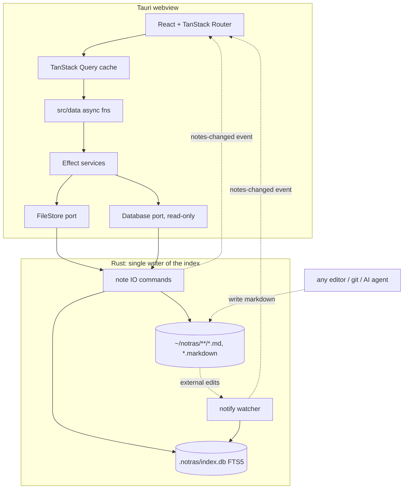

# ARCHITECTURE

How notras is built. `AGENTS.md` maps the rest of the docs.

## Tech stack

| Layer           | Choice                                                                                                       |
| --------------- | ------------------------------------------------------------------------------------------------------------ |
| Shell           | Tauri 2 (Rust): file IO commands, FTS5 index, notify watcher, tray, global shortcuts                         |
| Frontend        | Vite + React 19 + TanStack Router (file routes, no SSR); TanStack Query caches every read (`D66`)            |
| Editor          | TipTap 3 WYSIWYG + official `@tiptap/markdown` (bidirectional GFM); lowlight code blocks; ⌘E raw-source view |
| Effect          | Effect 4 (`4.0.0-rc.x`, pinned exactly): typed errors, Layer/DI, `Context.Service`, ManagedRuntime           |
| Index queries   | Drizzle ORM `sqlite-proxy`, SELECT-only                                                                      |
| UI              | Shadcn UI (base-maia style on Base UI) + Tailwind CSS 4, on the stet palette (`D23`)                         |
| Note surface    | shadcn/typeset, vendored verbatim; tuned through the `.typeset-note` preset (`D40`)                          |
| Lint + format   | Ultracite (Biome preset) for dev tooling; TipTap's markdown serializer is the runtime canonical form         |
| Testing         | Vitest + happy-dom (TS), `cargo test` (Rust)                                                                 |
| Package manager | pnpm                                                                                                         |

## Files are the source of truth

Notes are `.md` or `.markdown` files under the notes dir (default `~/notras`). Folders are directories. `pinned` and `tags` live in YAML frontmatter. The SQLite index at `.notras/index.db` is derived and disposable: deleting it triggers a rebuild on launch.



**Rust is the single writer of the index.** Every TypeScript mutation goes through a Rust command (`write_note`, `rename_note`, `delete_note`, and the rest) that writes the file and updates the index in the same call, then emits `notes-changed`. The `db_select` command rejects anything that is not SELECT/WITH, gated on SQLite's own `sqlite3_stmt_readonly` so a writable `WITH ... DELETE` CTE cannot pass the prefix test. There is no index write path from TypeScript.

**External writers** (AI agents, other editors, git) are reconciled by the debounced watcher. The mtime skip in `index_file` keeps self-writes from echoing. UI refresh is event-driven: the root route listens for `notes-changed` and invalidates the query keys the event names, so only the tabs holding a changed file re-read (`D66`).

**The index is disposable.** `ensure_schema` runs CREATE IF NOT EXISTS plus FTS5 on startup, so deleting `.notras/index.db` triggers a rebuild. There is no drizzle-kit, no migration directory, and no `db:push`.

**A rebuild drops the rows first.** `index_file` skips a file whose mtime matches its stored row, which suppresses watcher echo but also makes a plain re-scan a no-op. `reindex_all` calls `index::clear` before scanning, so changing how a row is derived, `resolve_title` for instance, reaches notes nobody has edited since. Without that, an unedited note keeps whatever the old derivation produced and the only recovery is deleting the database.

**Note identity is the relative path.** Renames are delete plus create in the index. Wikilinks resolve by title and then by filename stem, so a retitle can dangle links, a consequence `D5` accepts. `D32` added the stem fallback and the tie-break that orders duplicate titles.

**The title is resolved, not stored.** Frontmatter `title:`, else the leading `#` heading, else the filename stem. `resolve_title` in `src-tauri/src/index.rs` fills the index column and `resolveTitle` in `src/core/notes.ts` serves the open note.

**Retitling is the one act that writes a title.** `NoteService.retitle` rewrites an existing leading heading and an existing `title:` key, then renames the file to `filenameFromTitle` of the title. Neither a heading nor a key is ever introduced, so a note carrying neither is only renamed, and nothing renames a file except that explicit action.

**Frontmatter has two parsers.** `src/core/frontmatter.ts` and `src-tauri/src/frontmatter.rs` implement the same deliberately tiny dialect: `pinned: bool`, `tags` inline or block list, `title` read-only. Change one, change the other, and cover both with tests. The TypeScript serializer preserves unknown keys verbatim, so externally authored notes survive round-trips, and `title` is one of them.

## Index schema

Rust creates the tables. `src/server/db/schema.ts` mirrors `note` and `note_tag` as Drizzle definitions so SELECTs are typed. `note_fts` has no mirror and is reached only through the raw `sql` in `fts-query.ts`.

```sql
note(path TEXT PK, title TEXT, folder TEXT, pinned INT, created_at INT, updated_at INT)
note_tag(path TEXT, tag TEXT, PRIMARY KEY(path, tag))
note_fts(path UNINDEXED, title, content)  -- fts5, unicode61; bm25 + snippet()
```

`src/server/db/fts-query.ts` owns query normalization, ranking, and the snippet markers: `buildFtsMatchQuery`, `getSnippetExpression`, `getSearchOrderBy`, `getFtsMatchFilter`, `getTagFilter`.

## Project structure

```txt
src/
  main.tsx            # Vite entry -> App (router, or capture window branch)
  app-shell.tsx       # Router setup + ?window=capture branch
  styles.css          # Tailwind 4 theme, fonts, editor + titlebar styling
  typeset.css         # shadcn/typeset, vendored verbatim (D40); do not edit
  styles.spec.ts      # contrast gate, task-list ladder, note surface,
                      # launch background
  routes/             # TanStack Router file routes
    __root.tsx        # loader primes the cache, palette, settings dialog,
                      # hotkeys, notes-changed listener
    index.tsx         # THE page: the workspace -- tab strip, every open
                      # tab's session, and the two bands (D53)
  components/
    editor/           # TipTap wrapper, extensions, suggestions, autosave, typewriter
    tabs/             # the title bar's tab strip
    workspace/        # note-session: one open tab, note or external (D54)
    notes/            # note-controls (save/pin), note-tags, use-note-tags,
                      # save-indicator, status-bar
    command-palette.tsx
    settings-dialog.tsx
    capture-window.tsx
    titlebar.tsx      # the drag region, declared once for every window/route
    ui/               # Shadcn components (generated, do not hand-edit)
  core/               # Isomorphic bottom layer (no platform imports)
    frontmatter.ts    # parse/serialize {pinned, tags}; preserves unknown keys
    notes.ts          # NoteMeta, NoteFilters, path/title helpers
    file-store.ts     # FileStore port (Context.Service)
    errors.ts         # DatabaseError, FileError
    fts-markers.ts    # [[hl]] snippet markers shared with SQL
  data/               # Plain async fns the UI calls (ex-server-actions)
    queries.ts        # THE query keys and options, one factory (D66)
    run.ts            # THE Effect boundary: AppRuntime.runPromiseExit wrapper
  server/
    adapters/         # the only note IO and SQL path to @tauri-apps/*;
                      # UI code reaches it for events, dialogs and windows
      tauri-file-store.ts   # FileStore -> Rust commands
      tauri-database.ts     # drizzle sqlite-proxy -> db_select command
    db/               # Database service, index schema mirror, fts-query helpers
    repositories/     # note-repository: SELECTs against the index
    schemas/          # Effect Schema validation (titles, folder names)
    services/         # note-service, app-layer
    runtime.ts        # AppRuntime (ManagedRuntime), wires the adapters
  lib/                # Client utilities
    pending-flush.ts  # autosave flush registry read by the quit handshake
    prefs.ts          # focus mode and typewriter, app-wide (D53)
    tabs/             # the open set: tab.ts is the list algebra, store.ts
                      # the stores the chrome and sessions read
    updater.ts        # release check, offer toast, install + relaunch
    ui/chrome.ts      # CHROME_GLYPH (D51)
    ui/failure.ts     # errorMessage(): narrows a rejection to user-facing text
    ui/utils.ts       # cn()
    utils/            # fts-snippet, tag-query, word-count
src-tauri/
  src/lib.rs          # setup: notes dir, index, watcher, tray, shortcuts
  src/notes.rs        # note IO commands (write/rename/delete/attach/external)
                      # and db_select
  src/index.rs        # index schema, indexer, scan, read-only select
  src/frontmatter.rs  # Rust twin of src/core/frontmatter.ts
  src/watcher.rs      # debounced notify watcher -> reindex -> event
  src/state.rs        # AppState (notes dir, index connection, quit flags)
  icons/              # GENERATED by scripts/icons.sh, do not hand-edit
assets/               # Icon sources (D33), plus the GENERATED hero
  hero.png            # GENERATED README banner: mark + wordmark + tagline
  icon.svg            # the mark; drives 41-96px and the favicon
  icon-small.svg      # 32px: no accent, enlarged eyes
  icon-tiny.svg       # 16px: two-blob silhouette, no dots
  icon-light.svg      # light-scheme favicon
  tray.svg            # menu bar template, alpha only
  icon-render.png     # 1254px clay render; drives 97px and up
public/               # GENERATED favicons, served at the web root
scripts/
  icons.sh            # assets/ -> src-tauri/icons/ + public/ (macOS only)
  update-shadcn.sh    # regenerate every installed Shadcn component
  update-typeset.sh   # re-fetch src/typeset.css from upstream (D40)
.github/
  homebrew/
    notras.rb.tmpl    # cask rendered by release.yml, pushed to the tap
```

## Layer boundaries

Nothing enforces these. Lint held them until `D41` retired the ESLint config, and `D43` records why they were not ported to Biome. Review is the check now, and the fix for a violation is never to move the import.

- **`src/core/**` is isomorphic.** No `@tauri-apps/*`, `react`, `react-dom`, or `node:*`, and no upward imports from `@/server`, `@/lib`, `@/components`, or `@/data`. It runs in the webview and in any other runtime, which is what makes it testable without a window.
- **`src/server/{db,repositories,schemas,services}/**` is platform-free.** No `@tauri-apps/*`, `react`, or `react-dom`, and no imports from `@/lib`, `@/components`, or `@/data`. Inject behavior through the ports instead: `FileStore` in `src/core`, `Database` in `src/server/db`. Only `src/server/adapters/**` and `src/server/runtime.ts` may import `@tauri-apps/*`.
- **UI code** (`src/components`, `src/routes`, `src/lib`) may use `@tauri-apps/*` for UI concerns: events, dialogs, window control. Note file IO and SQL go through `src/data`.

## Key patterns

### Data access

The UI calls plain async functions in `src/data/`, one concern per file. They validate with Effect Schema where the input is user-shaped, and run effects via `run()` from `src/data/run.ts`, the only place `AppRuntime` is executed. `run()` unwraps typed failures into plain `Error`s, so a caller can write `toast.add({ title: error.message, type: "error" })`.

Reads reach those functions through TanStack Query. `src/data/queries.ts` is the only place a key over `src/data` is written: `noteQueries` for everything a note write can affect, `notesDirQuery` for the folder that settings owns. A query over something else, such as the launch-at-login switch the OS owns, is keyed beside the component that shows it. Its keys run generic to specific, so every invalidation the app performs is one prefix, and `D66` carries the rest. Writes stay direct calls, with one exception: `useNoteTags` goes through a mutation whose scope is the note's path, which is what serializes the two surfaces `D31` allows (`D67`). `useAutosave` keeps its own chain (`D54`).

### Effect style

Services are `Context.Service<Self, IShape>()("notras/...")` classes carrying their own `static readonly layer`, so no service has an `XxxLive` const. An adapter still does: `TauriFileStoreLive` is a `Layer.succeed` over the `FileStore` port. Reach a service with `Service.use((svc) => svc.method(...))` rather than `Effect.flatMap(Tag, fn)`. Methods with a generator body are `Effect.fn("Service.method")`; plain delegations stay one-liners. Errors are `Schema.TaggedError`. Services convert `DatabaseError` to defects with `.pipe(Effect.orDie)`; `FileError` stays typed because its message reaches the user.

### Test seam

A service whose layer bakes in dependencies also exposes `layerNoDeps`, as `NoteService` does, so specs can provide stubs. `note-service.spec.ts` wires it with an in-memory `FileStore` and a stub `NoteRepository`.

### Routes

TanStack Router file routes, laid out the way `AGENTS.md` requires. Route option objects are left unsorted: `ultracite/biome/tanstack` turns the `useSortedKeys` assist off under `src/routes/**` because the option types infer in declaration order. Nothing checks the order itself.

### The editor owns its buffer

`Editor`, the TipTap wrapper, freezes all props except the writing-mode toggles at mount through a `useState` initializer. Loading different content means remounting via `key`. Callbacks passed to it must be freeze-safe: read live values through refs or stable getters, never through closures over render state.

### Body-only editing

The editor holds the note body as markdown. Frontmatter is parsed off at load with `parseNote` and reattached at save with `composeNote`, always from the session's latest read, so a body save never clobbers a pin or tag toggle. ⌘E is a raw-source view over the whole file.

### Markdown round-trip contract

`markdown-roundtrip.spec.ts` pins the set of constructs that must survive file to editor to file. Extend it when adding nodes. Custom syntax uses the extension-config trio `markdownTokenName`/`markdownTokenizer` plus `parseMarkdown` and `renderMarkdown`; `wikilink.ts` is the worked example. Overriding an upstream parse decision means owning the token (`D58`), and owning it for parsing means owning it for rendering: the render path resolves a node through the parse registry first, so a handler with no `renderMarkdown` renders nothing.

### An attachment destination is a URL

`attachments/` holds a path and the doc holds a destination, which are different strings (`D57`). Three places convert, through `src/lib/utils/attachments.ts`: `attachmentLink` and the paste handler encode on the way in, `resolveImageSrc` decodes before `convertFileSrc`, and `NoteImage` and `NoteLink` escape on the way out.

### Editing session per tab

The workspace renders one `NoteSession` per open tab, keyed by tab id, so autosave state cannot leak across notes. That id is minted when the tab opens and is opaque: a rename gives the tab a new `path` and the same id, so the session lives through the rename instead of remounting (`D56`). Finding the tab that holds a path is a lookup in `store.ts`, never a key someone rebuilds. Several are alive at once and only the active one is shown, which is what makes a switch lossless (`D53`). Autosave in `use-autosave.ts` debounces 800ms on a Pacer timer, serializes on a chain of its own so overlapping flushes cannot land out of order, and flushes on blur, unmount, and quit (`D68`). It takes the write as an argument, so a note and an external file share it (`D54`), and `pending-flush.ts` aggregates every live buffer. Rust holds `ExitRequested` until the webview reports back, and a failed flush cancels the quit through `cancel_quit`.

An update restart is the exception. It reaches `ExitRequested` carrying `RESTART_EXIT_CODE`, which Tauri refuses to prevent, so `lib.rs` returns before the handshake rather than opening one it cannot honour. `installUpdate` in `src/lib/updater.ts` awaits `flushPendingWrites` itself between `downloadAndInstall` and `relaunch`. A failed flush leaves the app running the old version rather than restarting, and the bundle already downloaded applies the next time someone launches it.

### External-change reload guard

A re-read replaces the buffer only when the buffer is clean and the file's mtime is newer than our own last write, tracked in `lastSavedAtRef`. A stale read of a just-saved note must never clobber the buffer. Do not simplify this check away.

### Adding a Rust command

Define it in `src-tauri/src/notes.rs` or a new module, register it in `generate_handler!` in `lib.rs`, and expose it through the `FileStore` port plus the `tauri-file-store.ts` adapter if it is note IO. A command that mutates an indexed note must index synchronously and call `emit_changed`. The three that do neither write nothing the index covers: `attach_file` and `attach_image` copy into `attachments/`, and `write_external` writes outside the notes dir.

### The palette is the action surface

`command-palette.tsx` holds search, tag filtering via `#`, new note, pin, tag editing, rename, move, delete, reveal, settings, reindex, and the update check. New note-level actions belong there rather than in new chrome.

One component serves two doors. `find` and `actions` are the two root members of `PaletteView`, and the mode is explicit state seeded from the `mode` prop rather than parsed out of the query, so `#` stays a find-mode grammar and nothing crosses between the two by typing. `__root.tsx` owns which door opened, registers ⌘P and ⌘⇧P, and keys the component on the mode so switching re-seeds it. The palette reads chords through `useChordsByName` and registers none itself, which `src/lib/ui/shortcuts.ts` requires.

`move`, `delete`, `rename`, and `tags` are the other sub-views of `PaletteView`, all entered from actions and all returning to it with an empty input, since each repurposes the palette input for its own draft. The tags view is the one place an action row does not dismiss the palette: toggling calls `changeTags` from `useNoteTags` rather than `runAction`, so several tags can be set in one visit (`D31`).

`#` parses through `parseTagQuery` in `src/lib/utils/tag-query.ts`: the token becomes `NoteFilters.tag`, an exact indexed match, and anything after it becomes the FTS query, which `findMany` ANDs with it. So `#work budget` searches "budget" inside the `work` tag. The counted vocabulary comes from `NoteService.listTags()` through the root loader, not from the loaded notes.

### Preferences

Window state lives in `localStorage`: the writing-mode toggles in `src/lib/prefs.ts` and the open tab set in `src/lib/tabs/store.ts` (`D53`). Both are TanStack Store, and the tab module keeps the open set in one store and the per-tab snapshots in another (`D70`). `notesDir` lives in `settings.json`, written by Rust through `tauri-plugin-store`. TypeScript reaches it through the `FileStore` port: `get_notes_dir` and `set_notes_dir` behind `src/data/notes-dir.ts`. Changing the folder re-scans and re-watches, and re-grants the asset protocol scope at runtime.

### Snippet rendering

FTS snippets carry `[[hl]]` and `[[/hl]]` markers, defined in `src/core/fts-markers.ts` so the SQL and the renderer share one definition. `getSnippetParts` parses them into segments. Nothing renders a snippet through `dangerouslySetInnerHTML`.

## Invariants

Each of these holds a property the architecture depends on. Breaking one is a design change, not a refactor.

- **TypeScript never writes the index.** No non-SELECT support in `db_select`, no SQL writes from a repository. Rust is the only writer, which is what removes the transaction-serialization problem entirely.
- **`@tauri-apps/*` imports stay inside `src/server/adapters/**`, `src/server/runtime.ts`, and UI-concern code.** No tool checks this since `D43`, so a reviewer holds it.
- **The two frontmatter parsers change together.** A change to one without the other, with tests on both sides, lets an external note lose data on a round-trip.
- **The two title resolvers change together.** `resolve_title` and `resolveTitle` assert one shared table of cases, in the same order, in `src-tauri/src/index.rs` and `src/core/notes.spec.ts`. Drift shows up as an index title that disagrees with the open note's, which nothing else catches.
- **Every editor node defines its markdown form and appears in the round-trip spec.** A node without one silently drops content from externally authored files.
- **Indexed note IO reaches no path outside the notes dir.** It goes through Rust commands, so the dynamic scope is enforced at runtime, which is why the `fs` plugin is not installed. Three commands take a host path the user picked and stay out of the index: `read_external`, `write_external`, and `attach_file`. Adding a fourth means asking who chose the path.
