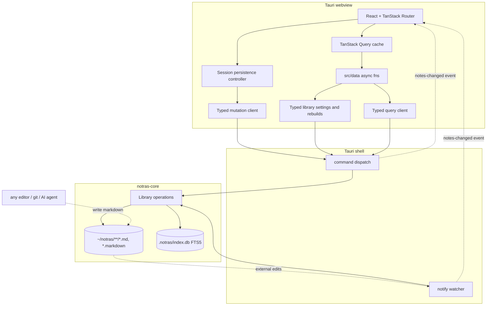

# ARCHITECTURE

How notras is built. `AGENTS.md` maps the rest of the docs.

## Tech stack

| Layer           | Choice                                                                                                       |
| --------------- | ------------------------------------------------------------------------------------------------------------ |
| Shell           | Tauri 2 (Rust): command dispatch, notify watcher, tray, global shortcuts                         |
| Frontend        | Vite + React 19 + TanStack Router (file routes, no SSR); TanStack Query caches every read (`D66`)            |
| Editor          | TipTap 3 WYSIWYG + official `@tiptap/markdown` (bidirectional GFM); Shiki code blocks; ⌘E raw-source view |
| Note engine     | `notras-core`: files, Markdown interpretation, `rusqlite` index and typed operations                                                                      |
| Native contract | Pinned Specta types and Tauri commands/events; Serde wire values and thiserror failures |
| UI              | Shadcn UI (base-maia style on Base UI) + Tailwind CSS 4, with the reading palette (`D73`)                    |
| Note surface    | shadcn/typeset, vendored verbatim; tuned through the `.typeset-note` preset (`D40`)                          |
| Lint + format   | Ultracite (Biome preset) for JS/TS; rustfmt and Clippy for Rust; TipTap's markdown serializer is the runtime canonical form |
| Testing         | Vitest + Testing Library + happy-dom (TS), `cargo test` with cargo-llvm-cov reports (Rust) |
| Package manager | pnpm                                                                                                         |

## Files are the source of truth

Notes are `.md` or `.markdown` files under the notes dir (default `~/notras`). Folders are directories. `Library::open` resolves the selected root, including a root symlink, and the shell uses that resolved path for watching and attachment access. `pinned` and `tags` live in YAML frontmatter. The SQLite index at `.notras/index.db` is derived and disposable: deleting it triggers a rebuild on launch.



**Rust is the single writer of the index.** Rust publishes complete documents, allocates filenames without overwriting another note, and reconciles the index under the library lock. The editing session owns changes to the document. Committed bytes remain successful when index reconciliation fails. Commands emit affected paths after releasing the lock.

**External writers** (AI agents, other editors, git) are reconciled by the debounced watcher. The mtime skip in `index_file` keeps self-writes from echoing. UI refresh is event-driven: the root route listens for `notes-changed` and invalidates the query keys the event names, so only the tabs holding a changed file re-read (`D66`).

**The index is disposable.** `ensure_schema` creates the tables and FTS5 on startup, so deleting `.notras/index.db` triggers a rebuild. There is no drizzle-kit, no migration directory, and no `db:push`. `PRAGMA user_version` carries `SCHEMA_VERSION`. Opening an older index recreates its tables and advances the version in one transaction. The startup scan then derives every row from the saved files, including unchanged notes.

Index reconciliation propagates SQLite read and decoding failures. Only a missing note row counts as an absent stored timestamp. A scan reads all indexed paths successfully before deleting stale entries. Removing one note's rows from the note, tag, link and search tables uses one transaction; a failed deletion rolls back that note's index changes. A scan records per-file path conversion failures and continues processing valid files. Any such failure defers all stale-row cleanup because the scan cannot reliably match every existing file to its indexed path. Cleanup resumes on a scan without conversion failures. Database failures still reject the operation. A scan can retain successful work on other notes before a later failure.

**A rebuild retains usable rows while refreshing them.** Forced scans bypass the mtime skip and replace each note's derived rows in one transaction. Normal scans still skip unchanged files. Cleanup validates all indexed paths before deleting any stale rows, then checks each candidate against the current filesystem. A foreground create or move after enumeration cannot be mistaken for a deletion.

**Note identity is the relative path.** Renames are delete plus create in the index. Wikilinks resolve by title and then by filename stem, so a retitle can dangle links, a consequence `D5` accepts. `D32` added the stem fallback and the tie-break that orders duplicate titles. Rust resolves saved relationships in `relationships.rs`; `linkResolver` in `src/core/links.ts` resolves editor clicks. Shared fixtures cover title precedence, same-folder preference, Unicode scalar path ordering for ties, and mdurl-compatible percent decoding.

**The heading supplies the name.** The leading `#` heading takes precedence over an imported frontmatter `title:`, with the filename stem as the last fallback. TypeScript and Rust use the same resolution order. Existing frontmatter titles remain verbatim.

**Only an in-app heading edit requests a derived filename.** Editor transactions report heading edits explicitly, including edits whose final text is unchanged. Rename edits the live heading and introduces it when absent. Rust recomputes the available filename for each naming request. Empty headings, reads, searches, and external observations do not request renaming. Undo restores the heading and the filename associated with its action; an occupied destination receives a suffix.

**Frontmatter has two parsers.** TypeScript parses and edits the live document; Rust parses persisted documents for indexing and direct reads. Both interpret `pinned`, `tags`, and imported `title` values. Pin and tag controls update the session document, preserving unknown fields and the closing delimiter. They share its history and persistence with source edits.

## Index schema

Rust owns the tables and their queries. The webview sends structured filters and receives typed results; it holds no schema mirror or SQL builder.

```sql
note(id INTEGER PK, path TEXT NOT NULL UNIQUE, title TEXT, folder TEXT, pinned INT, created_at INT, updated_at INT, body_line_offset INT)
note_tag(path TEXT, tag TEXT, PRIMARY KEY(path, tag))
note_prose_fallback(path TEXT PK)  -- bodies requiring literal phrase scanning
note_link(path TEXT, line INT, kind TEXT, target TEXT, context TEXT)  -- one row per link destination, kind distinguishing wikilink, link, and destination, indexed by path
note_fts(path UNINDEXED, title, content)  -- fts5, unicode61; bm25 + snippet()
```

`note.id` is an internal SQLite key, shared with `note_fts.rowid`. It remains stable through note updates and database compaction. Paths remain note identity outside the index. Updates and deletes address FTS rows through this key; deleting a note removes its FTS entry before its key disappears, within the same transaction. Schema version 8 rebuilds older indexes to record each body's original line offset. The body remains in FTS, so prose queries do not duplicate document storage.

`queries.rs` owns FTS normalization, AND-prefix matching, BM25 ordering and 24-token snippets. Ranking joins FTS to notes by the integer key. All search filters intersect before the 30-result cap. Result hydration loads metadata, tags and snippets after that cap; filter evaluation separately reads library metadata for membership and relationship resolution. `src/core/fts-markers.ts` carries the matching display markers. FTS snippets take precedence over filter context; otherwise the first filter that supplies context wins. Tag reads use insertion order to preserve frontmatter order. The frontend retains locale-aware sorting for displayed note groups; duplicate-title resolution uses Unicode scalar path ordering. Folder hubs retain their prior JavaScript string ordering.

`note_link` stores destinations; graph reads select only `wikilink` and `link` kinds. A row is one `[[...]]` as the file holds it: `line` counts from the top of the file so `grep -n` agrees, `kind` is `wikilink`, `link`, or `destination`; `link` is for a `[text](note.md)` whose destination `is_note_path` accepts, `target` is the text between the brackets or the destination as written, and `context` is the line. Nothing in the row is resolved. `relationships.rs` resolves a target on read, a wikilink by title and a link by path relative to the note, so a note created or retitled after the link was written is still found, and groups the rows that resolve to a note by the note they come from. The scanner in `markdown.rs` records rendered destinations: pulldown-cmark decides what is code, HTML, or a link destination, and a byte mask over the body carries the rest. A title written bare is not a row, because it depends on another note's title, which the file being indexed cannot know. `find_mentions` finds those in indexed bodies on read: FTS and `note_prose_fallback` name candidates for a note reference, excluding the current note from both sets, and the same mask decides which occurrences are prose. The `mention:` search filter requests an arbitrary phrase, including headings. Mention requests take only a path; Rust reads the target title from the index. ASCII phrases with letters or digits use FTS candidates plus files with non-ASCII bodies; punctuation-only and non-ASCII phrases scan the indexed bodies. Prose reads join FTS content to `note.body_line_offset`, preserving original file line numbers in the same snapshot as titles, tags and explicit links. External edits reach those queries after indexing; query execution never reopens a candidate file. `note_prose_fallback` stores paths for non-ASCII bodies and NUL-containing bodies retained by the previous SQL predicate. Indexing maintains those paths in the same transaction as FTS. It avoids reading each stored body on every candidate lookup. The schema version rebuilds this metadata for existing libraries. This retains matches that unicode61 can miss because its Unicode case folding and word boundaries differ from the literal scanner. Bare GFM autolinks are recognized within eligible prose and excluded from phrase spans. Autolink scanning masks explicit link spans once and advances through precomputed wikilinks, skipping a wikilink only at its opening offset. The index schema version rebuilds destination rows for unchanged files too.

## Project structure

```txt
src/
  main.tsx            # Vite entry -> App (router, or capture window branch)
  app-shell.tsx       # Router setup + ?window=capture branch
  styles.css          # Tailwind 4 theme, fonts, editor + titlebar styling
  typeset.css         # shadcn/typeset, vendored verbatim (D40); do not edit
  styles.spec.ts      # contrast gate, task-list ladder, note surface,
                      # launch background
  routes/             # TanStack Router file routes
    __root.tsx        # loader reads the library directory, palette, settings dialog,
                      # hotkeys, notes-changed listener
    index.tsx         # THE page: the workspace -- tab strip, every open
                      # tab's session, and the two bands (D53)
  components/
    editor/           # TipTap wrapper, extensions, suggestions, autosave, typewriter
    graph/            # the ring layout and the graph view a tab swaps to
    tabs/             # the title bar's tab strip
    workspace/        # note-session: one open tab, note or external (D54)
    notes/            # note-controls (save/pin), note-tags, use-note-tags,
                      # note-mentions, save-indicator, status-bar
    command-palette.tsx
    settings-dialog.tsx
    capture-window.tsx
    titlebar.tsx      # the drag region, declared once for every window/route
    ui/               # Shadcn components (generated, do not hand-edit)
  core/               # Isomorphic bottom layer (no platform imports)
    frontmatter.ts    # parse/serialize {pinned, tags}; preserves unknown keys
    notes.ts          # NoteMeta, NoteFilters, path/title helpers
    errors.ts         # FileError
    fts-markers.ts    # [[hl]] snippet markers shared with SQL
    links.ts          # editor link resolution and mention display types
    graph.ts          # graph display types and hub labels
  data/               # Plain async fns the UI calls (ex-server-actions)
    queries.ts        # THE query keys and options, one factory (D66)
    native-command.ts # typed native failure normalization
  server/
    adapters/         # generated native IPC boundary
      bindings.ts          # GENERATED native commands, events and wire types
  lib/                # Client utilities
    pending-flush.ts  # autosave flush registry read by the quit handshake
    prefs.ts          # focus mode, app-wide (D53)
    tabs/             # the open set: tab.ts is the list algebra, store.ts
                      # the stores the chrome and sessions read
    updater.ts        # release check, offer toast, install + relaunch
    ui/chrome.ts      # CHROME_GLYPH (D51)
    ui/failure.ts     # reasonOf(): the reason a rejection carries, or nothing
    ui/mentions.ts    # the mentions list's open state: strip, chord and palette share it
    ui/graph.ts       # which tabs show their graph, and the hop that keeps it on
    ui/utils.ts       # cn()
    utils/            # fts-snippet, word-count
Cargo.toml            # workspace dependencies and release profile
Cargo.lock            # shared Rust dependency lockfile
rust-toolchain.toml   # pinned toolchain and components
crates/notras-core/
  src/lib.rs          # Library owner and host observation operations
  src/application.rs  # file operations and mutation results
  src/frontmatter.rs  # Rust twin of src/core/frontmatter.ts
  src/index.rs        # index schema, indexer and candidate selection
  src/markdown.rs     # title interpretation, links and literal prose scanning
  src/note_file.rs    # opened-file content, metadata and checked timestamps
  src/relative_path.rs # library path validation and descendant symlink checks
  src/queries.rs      # saved-library query operations and results
  src/scan.rs         # resumable traversal, per-file indexing and stale cleanup
  src/relationships.rs # saved link resolution, mentions and graph membership
src-tauri/
  src/lib.rs          # setup: library, watcher, tray, shortcuts
  src/bindings.rs     # shared command/event registry, export and IPC tests
  src/notes.rs        # Tauri handlers: blocking dispatch, locks and events
  src/watcher.rs      # debounced host paths -> Library reconciliation -> event
  src/windows.rs      # window commands; a command may not live in lib.rs
  src/state.rs        # AppState (library coordinator, watcher, quit flags)
  src/library.rs      # foreground guards, cooperative scans, recovery and publication
  icons/              # GENERATED by scripts/icons.sh, do not hand-edit
assets/               # Canonical icon geometry (D74), plus the GENERATED hero
  hero.png            # GENERATED README banner: mark + wordmark + tagline
  icon.svg            # two sheets and fold; colors resolved from styles.css
public/               # GENERATED favicons and dark/light welcome marks
scripts/
  bindings.sh         # generate native bindings, or compare a temporary export
  icons.sh            # SVG + styles.css -> desktop, web and hero art (macOS only)
  update-shadcn.sh    # regenerate every installed Shadcn component
  update-typeset.sh   # re-fetch src/typeset.css from upstream (D40)
.github/
  homebrew/
    notras.rb.tmpl    # cask rendered by release.yml, pushed to the tap
```

## Layer boundaries

Nothing enforces these. Lint held them until `D41` retired the ESLint config, and `D43` records why they were not ported to Biome. Review is the check now, and the fix for a violation is never to move the import.

- **`src/core/**` is isomorphic.** No `@tauri-apps/*`, `react`, `react-dom`, or `node:*`, and no upward imports from `@/server`, `@/lib`, `@/components`, or `@/data`. It runs in the webview and in any other runtime, which is what makes it testable without a window.
- **The `notras-core` crate is window-free.** Its `Library` privately owns the library directory, SQLite connection and index health. The shell calls operations and cannot manipulate index state. `notes.rs` supplies the blocking task and library lock. Library settings and rebuilds use the same typed command boundary through `src/data`. Native bindings live in `src/server/adapters/**`.
- **UI code** (`src/components`, `src/routes`, `src/lib`) may use `@tauri-apps/*` for UI concerns: events, dialogs, window control. Note file IO and indexed reads go through `src/data`.

## Key patterns

### Data access

The UI calls plain async functions in `src/data/`, one concern per file. Queries, mutations, library settings and reindexing call generated operation commands through `nativeCommand`; Rust owns persisted metadata, filters and relationship resolution. `nativeCommand` converts expected native rejections and Tauri argument-decoding strings into `FileError`, a plain `Error` subclass with a `failed` or `not-found` kind and the original cause. The caller supplies the action and displays the reason. Unexpected defects go to the log through `tauri-plugin-log`, and the caller sees "an unexpected error" even if logging fails.

Reads reach those functions through TanStack Query. `src/data/queries.ts` owns note query keys. Open-note actions use the loaded session. The palette, pin control, and tag controls read its live snapshot. Tag controls pass additions and toggles through functional frontmatter patches evaluated against the current document. The combobox translates its rendered selection event into toggled tags at the control boundary. This preserves intervening edits before a rerender or save completes, including adding and then removing the same tag. One persistence queue saves complete documents and orders folder moves; query results cannot acknowledge an edit.

### Test seam

React tests run through Testing Library in happy-dom. `vitest.setup.ts` registers DOM matchers, the React act environment, and cleanup without enabling Vitest globals. Editor history and persistence tests use the real Tiptap engine. The happy-dom environment does not establish native IME behavior, layout, or selection feel.

Query tests use real SQLite and temporary note directories. Recorded fixtures preserve the former TypeScript graph, mention and filter behavior. Shared resolver fixtures run in Rust and TypeScript, including malformed percent encodings and duplicate titles. React tests fake the IPC boundary while using the real query adapters and cache.

Rust engine tests run independently with `cargo test -p notras-core --locked`. The engine exposes `Library` operations without an `AppHandle` or window dependency. Its optional `bindings` feature adds Specta metadata and is enabled by the shell. Tauri handlers run blocking work through `spawn_blocking` and obtain a library guard inside that task. A guard never crosses an `await`. Blocking tasks own decoded IPC inputs for their lifetime. Engine operations borrow paths, document text and options they only read, and retain ownership where values move into results or subsequent work.

State access panics if its mutex is poisoned; it does not expose potentially interrupted state. Blocking-task panics resume unwinding with their original payload. Non-panic task failures remain command errors. Release builds abort on panic.

Each native indexed query obtains a `ReadView` through `LibraryOwner`. It uses a separate read-only SQLite connection with a WAL read transaction, established under the operation guard before execution releases that guard. Metadata, FTS snippets, relationships and literal prose come from the same indexed version. A healthy scan retains a shared view from before its first step, so new queries remain available without exposing partial folder moves. Queries sharing that scan view serialize on its reader mutex, independently of file operations. Outside scans, each query obtains its own view. Fresh and dirty indexes require coordinated recovery, and readers waiting on a failed recovery receive its failure. Query results are rejected if the selected library generation changes during execution. Direct note reads parse metadata from the file independently of index health. Files changed by external writers are reconciled through the watcher, not isolated by this lock. `OpenedNote` reads content and metadata through one file handle, so an atomic pathname replacement cannot pair the replacement's bytes with the original file's timestamp. In-place writes remain outside that guarantee. Replacement publication uses `std::fs::rename`, whose Windows implementation supports replacing a destination with compatible open handles. The temporary file is marked non-temporary before publication, and a cleanup guard remains armed until rename succeeds. Creation and collision-safe renames retain `persist_noclobber`. Modification-time failures reject reads and indexing; the index retains its creation-time fallback when a birth time is unavailable. Graph reads can return explicit relationships with a separate indexed-prose decoding failure; mentions and search reject prose failures. Successful indexed mutations release the library lock before emitting `NotesChanged`. Library switches hold the watcher lock across preparation, settings persistence and replacement, and release the library lock before dropping the old watcher.

The IPC tests use Tauri's test runtime with the production command registry, temporary directories and real SQLite. Index failures are injected through a separate database connection; the shell has no access to the engine connection. They send JSON requests through Tauri's argument decoder and check serialized receipts, failures and events. They do not exercise an OS webview, tray or clipboard. Mutation receipts carry the committed path, timestamp and warnings. Path receipts also carry committed content and any remaining source. Data functions convert timestamps to `Date`. Controller tests supply persistence functions; mounted session tests exercise the real editor, tab store and query cache over the IPC boundary.

### Routes

TanStack Router file routes, laid out the way `AGENTS.md` requires. Route option objects are left unsorted: `ultracite/biome/tanstack` turns the `useSortedKeys` assist off under `src/routes/**` because the option types infer in declaration order. Nothing checks the order itself.

### The session owns the document

`note-document.ts` owns a Tiptap source editor whose single code block holds the complete Markdown document and ProseMirror history. The source view mounts onto that editor. Detaching it retains the document and history while removing view plugins, so rich edits do not run source highlighting. Rich mode projects the body and delegates edits, selections, undo, and redo to the same document. Mapping a rich selection to source offsets is optional: failed conversion omits the selection without suppressing a valid document edit. Restoring source offsets during a rich replacement is also optional: a mapping failure retains the transaction-mapped selection and still dispatches the replacement. Parsing the replacement itself remains fallible. Rename and metadata actions enter the same history. A filename history entry identifies the result of its action, including a native collision suffix; a new heading edit creates a fresh naming request. Editor callbacks are fixed at mount and read current session values through stable functions.

Both editor handles expose a `FindHandle` backed by the shared Tiptap `Find` extension. The extension maps text-block character offsets to ProseMirror positions, including atomic wikilink titles, and decorates matches without document changes or undo entries. A selection bookmark tracks the prior caret through edits.

`createFindController` binds one active editor handle and releases its subscription and highlights on handoff. The workspace owns one controller, and capture owns another. Their query and open state remain in memory. Sessions bind handles; the window owns shortcuts and the floating `FindBar`. A hidden or destroyed editor cannot receive navigation.

The root loader awaits only the library directory. The workspace loader restores saved tabs once. When there are none, `RecentNote` owns the optional latest-note query and its completion state. Its opening request applies only while the tab state still matches startup. Sessions observe the note list without suspending their document, history or persistence. Title suggestions and link hover resolution become available when the list arrives. A link activation without a loaded list awaits resolution and reports a failed read instead of claiming the destination is missing. Each activation supersedes the preceding one. Switching away from the originating tab or disposing its session cancels the pending action, so returning cannot revive it. Changes that leave the originating tab active do not cancel the action. Attached tag chips and typed tag choices use the live document while the counted vocabulary loads.

### Rich and source editing

The rich editor projects the body; source mode projects the complete Markdown. Both update one session document, and every save sends that complete document. The session retains only the sent revision until acknowledgement, so newer edits remain dirty. A receipt updates the committed path and timestamp without replacing live text. There are no field-specific revisions or title reconciliation patches.

### Markdown round-trip contract

`markdown-roundtrip.spec.ts` pins the set of constructs that must survive file to editor to file. Extend it when adding nodes. Custom syntax uses the extension-config trio `markdownTokenName`/`markdownTokenizer` plus `parseMarkdown` and `renderMarkdown`; `wikilink.ts` is the worked example. Overriding an upstream parse decision means owning the token (`D58`), and owning it for parsing means owning it for rendering: the render path resolves a node through the parse registry first, so a handler with no `renderMarkdown` renders nothing.

### Syntax highlighting

`code-block-shiki.ts` extends Tiptap's code-block node in both editors. Shiki tokens become inline decorations without changing the document or selection. An edit maps decorations for unchanged code-block nodes and retokenizes changed or inserted blocks. Converting code to prose removes its decorations. Source mode holds one code block, so an edit retokenizes that block. The node's Markdown renderer chooses a fence that preserves its language label and literal content. `syntax-highlighter.ts` initializes one highlighter per webview and loads packaged grammars on demand, including languages named inside Markdown fences. A completed load decorates the current document through a transaction excluded from undo history. A destroyed view receives no completion transaction. A loading failure reports a toast and stops further loading in that editor instance; the note remains editable.

`syntax-theme.ts` maps TextMate scopes to the CSS ink roles. The stylesheet owns the colors in both schemes, so a system appearance change needs no tokenization. Shiki's JavaScript regex engine runs within the existing CSP without WebAssembly compilation. The language picker lists the bundled grammars and preserves aliases and unsupported labels verbatim. Plain and unsupported fences receive no decorations (`D73`).

### An attachment destination is a URL

`attachments/` holds a path and the doc holds a destination, which are different strings (`D57`). Three places convert, through `src/lib/utils/attachments.ts`: `attachmentLink` and the paste handler encode on the way in, `resolveImageSrc` decodes before `convertFileSrc`, and `NoteImage` and `NoteLink` escape on the way out.

### Editing session per tab

The workspace renders one `NoteSession` per open tab, keyed by an opaque tab id that survives renaming. Each session owns its document, history, committed path, and ordered persistence queue. `note-persistence.ts` owns the 800ms debounce, file-read reconciliation, and derived presentation state. `useAutosave` subscribes and connects blur, unmount, and quit flushes. Tab chrome, including overflow choices, subscribes directly to the session's derived store through a registered reference and uses the filename until the document title is available; no React effect copies document snapshots into the tab store. `pending-flush.ts` retains a closing session until its final flush settles, then the session destroys its source editor. External files use the same document and save flow without indexing. A clean external update patches the mounted editor and resets document history without issuing a save. A failed final flush cancels quit.

An update restart is the exception. It reaches `ExitRequested` carrying `RESTART_EXIT_CODE`, which Tauri refuses to prevent, so `lib.rs` returns before the handshake rather than opening one it cannot honour. `installUpdate` in `src/lib/updater.ts` awaits `flushPendingWrites` itself between `downloadAndInstall` and `relaunch`. A failed flush leaves the app running the old version rather than restarting, and the bundle already downloaded applies the next time someone launches it.

### External-change reload guard

The controller accepts reads only for its committed path. It retains the latest observation while writes or folder moves are pending, then reconciles it when those operations settle. An observation for a former path is discarded. A re-read replaces the document only when it is clean and the file's mtime is newer than its acknowledged timestamp. Stale reads cannot replace newer local content.

### Adding a Rust command

Define the handler in `src-tauri/src/notes.rs` or the relevant shell module, and put platform-free file operations in `application.rs`. Annotate the handler with `#[specta::specta]` and register it in `bindings::builder`. That registry supplies both the production invoke handler and the generated TypeScript client. Run `pnpm bindings` after changing the contract. Persisted reads, mutations, library settings and reindexing reach the generated client through `src/data`. UI concerns call generated shell commands directly.

The published versions are pinned together: tauri-specta rc.21, specta rc.22 and specta-typescript 0.0.9. Binding generation compares Specta's unmodified temporary export with the committed file in CI before TypeScript checks. Biome excludes the generated file; TypeScript checks its command and event types with their callers. Knip ignores unused types in this generated file because Specta emits helper types independently of their use.

A command that can fail returns `Result<T, CommandError>`. The `From` implementations turn filesystem and index failures into a lowercase reason without an error number. Filesystem, SQLite, decoding, settings and task errors retain their underlying causes through Rust's `Error::source()`. Only `kind` and `message` cross IPC. The frontend supplies the action. Bindings preserve Tauri's promise rejection behavior, including bare string failures before a handler runs. Indexed mutations attempt reconciliation before returning a committed receipt. Reconciliation failures mark the index dirty and add warnings. Native index reads wait for coordinated recovery of a dirty index and fail if recovery is incomplete; direct file reads remain available. Main-window mutation warnings and the toaster live outside the workspace route, so a failed indexed query cannot hide them. Attachments and external files keep their existing storage boundaries. Log through `log`; `tauri-plugin-log` remains the destination.

### Native scan coordination

`src-tauri/src/library.rs` owns the selected `Library` and its operation mutex. Startup, explicit rebuilding, watcher batches and index recovery use `notras-core::Scan`. A step visits one directory entry, updates one note, validates one indexed path or checks one cleanup candidate. Each step releases the operation guard. A waiting foreground command takes precedence over the next step. File opening, Markdown parsing and the per-note transaction remain together, so a scan never publishes document bytes prepared before an intervening save. A large individual file can still hold the guard for its indexing or file operation. Indexed queries execute outside that guard.

Healthy scans serve the complete indexed version from before the scan. A fresh or failed index cannot appear as an empty or partial library. Recovery waits for a complete scan before creating a view. A failed scan or a mutation that fails indexing keeps the index dirty; finishing a scan cannot erase a mutation failure from an earlier step. Concurrent readers waiting for recovery share its completion and diagnostic cause. A mutation event during a scan may cause queries to return the older view, so the coordinator includes those mutation paths in its completion event even when the scan itself finds no changed files. The owner performs each indexed mutation and records its changed paths under the same operation guard, before a scan can advance or finish. Event publication happens after releasing that guard and does not record paths. Later queries then see the completed index. The core's synchronous query conveniences use the same read-only views after their health check.

Read views live only for an operation or an active scan and its outstanding queries. They use the existing WAL rather than copying the library. SQLite may retain WAL pages while those readers remain active; releasing them allows checkpointing to catch up. No reader can update the index, and opening a view does not create or repair its schema.

A scan belongs to the library generation in which it began. Replacement cancels the old scan and wakes waiting readers. Watcher batches carry their source generation. Only successful observations publish changes; reconciliation failures are logged without emitting an invalidation. Change publication checks that generation under a separate publication guard, after releasing the operation guard; replacement waits for an event already being published. Old work cannot index the replacement library or emit changes after its replacement. Watcher replacement happens after the operation guard is released, since dropping a watcher may join a callback. Selecting the current resolved directory preserves its coordinator and watcher rather than opening a competing writer. A different directory is scanned and watched before its setting is committed and the selected owner is replaced; commands can continue using the existing library during that preparation.

### The palette is the action surface

`command-palette.tsx` owns palette navigation and action execution. `palette-actions.tsx` renders action rows, `palette-note-views.tsx` owns note-operation views and their folder and tag queries, `palette-filters.tsx` renders filter choices, and `palette-search.tsx` reads and renders search results and token suggestions. Together they offer search, tag filtering via `#`, new note, pin, tag editing, show mentions, rename, move, delete, reveal, focus mode, markdown source, graph view, close tab, close other tabs, close tabs to the right, copy path, reopen last closed tab, quick capture, settings, reindex, and the update check. New actions belong there rather than in new chrome.

Palette search separates the input query, its debounced read, and the last displayed note results. Only results belonging to the current input become a displayed snapshot. A pending replacement retains that snapshot with disabled rows; completed empty states, failures without cached data, and filter choices clear the retained notes. A failed refresh keeps cached rows available beside the failure and retry action. The snapshot lives in the mounted search component, outside the query cache. Query keys and index invalidation remain unchanged. Search reports delayed loading and the displayed query to the palette, which owns the footer spinner and list scrolling. Changing the displayed query remounts its note group to select the first result; refreshing that query preserves row identity and selection. The loading timer starts only for an active read and is cleared on a query change or unmount.

Every action row carries a `needs` scope of `none`, `note`, `tab` or `editor`, and the filter offers it only where the workspace answers it. The `editor` scope checks for an attached editor handle, including a note behind graph view. That is what keeps pin and rename off an external file while copy path stays on it, and it is the one place the palette decides what it can act on. Focus mode takes `none`, since the pref it sets belongs to the app rather than to what is open; markdown source takes `tab`, since it is one tab's view state and the row reads it off that tab's snapshot.

One component serves two doors. `find` and `actions` are the two root members of `PaletteView`, and the mode is explicit state seeded from the `mode` prop rather than parsed out of the query, so `#` stays a find-mode grammar and nothing crosses between the two by typing. `__root.tsx` owns which door opened, registers ⌘P and ⌘⇧P, and keys the component on the mode, tag, and opening session so switching or reopening re-seeds it. Closing retains the mounted view for its exit animation. The palette reads chords through `useChordsByName` and registers none itself.

`src/lib/ui/shortcuts.ts` owns React registration through local `useHotkey` and `useHotkeys` hooks. They use TanStack's public keyboard manager for parsing, dispatch, platform conventions, and the live registry. Registration, callback changes, option updates, and cleanup run in layout effects, so an uncommitted render cannot change a live binding. The supported options are enabled state and the action name. Equal option values cause no registry publication, which lets a component read its own bindings without a render loop. Changing those options preserves the registration; removing or replacing a binding unregisters it.

`filters` has its own draft input and returns to the preserved find query. Its entry button sits outside the Command list, so asynchronous result selection cannot land on a filter action. `move`, `delete`, `rename`, and `tags` are the note sub-views of `PaletteView`, all entered from actions and all returning to it with an empty input, since each repurposes the palette input for its own draft. The tags view is the one place an action row does not dismiss the palette: toggling calls `changeTags` from `useNoteTags` rather than `runAction`, so several tags can be set in one visit (`D31`).

`src/core/search.ts` parses palette text into free text and typed AND filters. `searchNotes` sends the complete query to Rust through `noteQueries.search`, under the index invalidation prefix. Rust reads ranked FTS candidates, intersects filters, and caps the result at 30. Saved relationship queries resolve indexed links with operation-local title and path maps, then combine them with narrowed prose scans. Only completed results cross IPC. Folder suggestions and move choices derive ancestors and subtree counts from the note list. The input caret identifies the token to suggest and replace. The counted tag vocabulary comes from `list_tags` when a tag picker opens. Palette search requests its idle list with `limit: 20` and `sort: "updated"`, so Rust limits and orders recent notes before returning them. Search reads its own suggestions; move and tag views request their choices when opened. Pending and failed choice queries have local states instead of becoming empty results.

### Preferences

Window state lives in `localStorage`: focus mode in `src/lib/prefs.ts` and the open tab set in `src/lib/tabs/store.ts` (`D53`). Both are TanStack Store, and the tab module keeps the open set in one store and references to the sessions' derived presentation stores in another. Graph mode is per tab and in memory, in `src/lib/ui/graph.ts` rather than in the session: a hop opens the picked note through `openNote`, which replaces the showing tab with a new one, so the flag has to outlive the session it was set in, and the workspace renders one graph above the sessions while the active tab carries it. `notesDir` lives in `settings.json`, written by Rust through `tauri-plugin-store`. TypeScript reaches it through the generated `get_notes_dir` and `set_notes_dir` commands behind `src/data/notes-dir.ts`. Changing the folder re-scans and re-watches, and re-grants the asset protocol scope at runtime.

### Snippet rendering

FTS snippets carry `[[hl]]` and `[[/hl]]` markers from native SQL. `src/core/fts-markers.ts` defines the matching renderer markers; native query tests and frontend snippet tests verify the wire format. `getSnippetParts` parses them into segments. Nothing renders a snippet through `dangerouslySetInnerHTML`.

## Invariants

Each of these holds a property the architecture depends on. Breaking one is a design change, not a refactor.

- **TypeScript never writes the index.** Typed query commands return saved results. There is no generic SQL command. Rust is the only writer, which is what removes the transaction-serialization problem entirely.
- **`@tauri-apps/*` imports stay inside `src/server/adapters/**`, `src/data/native-command.ts`, and UI-concern code.** No tool checks this since `D43`, so a reviewer holds it.
- **The two frontmatter parsers change together.** A change to one without the other, with tests on both sides, lets an external note lose data on a round-trip.
- **The two title resolvers change together.** `resolve_title` and `resolveTitle` assert one shared table of cases, in the same order, in `crates/notras-core/src/markdown.rs` and `src/core/notes.spec.ts`. Drift shows up as an index title that disagrees with the open note's, which nothing else catches.
- **Every editor node defines its markdown form and appears in the round-trip spec.** A node without one silently drops content from externally authored files.
- **The two wikilink scanners change together.** `wikilinks` in `crates/notras-core/src/markdown.rs` and the editor's tokenizer assert one table of cases in one order, in `should_find_the_wikilinks_the_editor_renders` and `src/components/editor/wikilink.spec.ts`. Drift shows up as a mention the editor does not render as a pill, or a pill the strip does not count, which nothing else catches. `markdown_links` and `src/components/editor/markdown-link.spec.ts` are the same pair for `[text](note.md)`, and `is_note_path` and `isNotePath` are the one rule both apply.
- **Library IO validates relative paths and checks existing descendants before access.** `RelativePath` rejects empty, hidden and nonportable components and serializes paths with `/` separators. Direct operations reject symlinked files or parents; scans skip them. The index also rejects symlinked database paths. These checks do not isolate operations from concurrent changes to the filesystem. Explicit external-file reads and writes use user-selected host paths. Attachment imports may read a selected external source, but their destination uses the library boundary.
