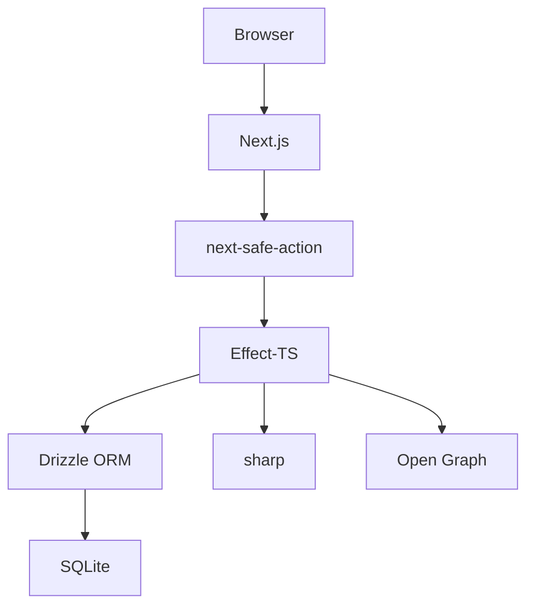

# notras

> Just write, otra vez.

A personal, single-user note-taking app that runs locally with a SQLite database. No accounts, no cloud sync -- just your notes on your machine.

## Features

- create, edit, and delete plain-text notes
- markdown preview with GFM support (tables, task lists, strikethrough)
- syntax highlighting in code blocks (powered by `rehype-expressive-code`)
- automatic "markdown" formatting on save (powered by `oxfmt`)
- pin notes to keep them at the top
- set reminders on notes from time presets (30 min, 1 hour, 3 hours, tomorrow, etc.)
- full-text search across all notes (SQLite FTS5 with tokenized prefix matching)
- filter by time period (today, yesterday, this week, this month, all time)
- sort by newest, oldest, or recently updated
- tag notes and filter by tag
- organize notes into folders with drag-and-drop
- attach images and PDFs to notes (images auto-optimized to WebP)
- extract links from note content and display them in a sidebar
- export notes as a zip and import from backup (merge or mirror)
- user preferences (markdown preview, syntax highlighting)
- keyboard shortcuts for everything
- animated transitions
- dark/light mode (follows system preference)
- installable as a progressive web app (pwa) on desktop and mobile

## Technologies

### Tooling

- [pnpm](https://pnpm.io)
- [ESLint](https://eslint.org)
- [Oxfmt](https://oxc.dev)
- [Vitest](https://vitest.dev)
- [Lefthook](https://github.com/evilmartians/lefthook)
- [Knip](https://knip.dev)
- [Playwright](https://playwright.dev)
- [GitHub Actions](https://github.com/features/actions)

### Frontend

- [Next.js](https://nextjs.org) 16 (App Router, Turbopack, React Server Components)
- [React](https://react.dev) 19
- [Shadcn UI](https://ui.shadcn.dev)
- [Radix UI](https://www.radix-ui.com) (headless primitives)
- [Tailwind CSS](https://tailwindcss.com) 4
- [React Hook Form](https://react-hook-form.com)
- [next-safe-action](https://next-safe-action.dev) (type-safe server actions)
- [Motion](https://motion.dev)
- [dnd-kit](https://dndkit.com) (drag-and-drop)
- [Sonner](https://sonner.emilkowal.ski)
- [Lucide](https://lucide.dev)
- [nuqs](https://nuqs.47ng.com) (URL search state)
- [react-hotkeys-hook](https://react-hotkeys-hook.vercel.app)
- [react-markdown](https://github.com/remarkjs/react-markdown) + [remark-gfm](https://github.com/remarkjs/remark-gfm)
- [rehype-expressive-code](https://expressive-code.com) (syntax highlighting)
- [@tailwindcss/typography](https://tailwindcss.com/docs/typography-plugin) (prose styles)
- [date-fns](https://date-fns.org) (date formatting)

### Backend

- [SQLite](https://www.sqlite.org) via [libSQL](https://turso.tech/libsql) (`@libsql/client`)
- [Drizzle ORM](https://orm.drizzle.team)
- [Effect](https://effect.website) 3.x (typed errors, Layer/DI, Effect Schema, structured logging)
- [sharp](https://sharp.pixelplumbing.com) (image optimization)
- [fflate](https://github.com/101arrowz/fflate) (zip compression)
- [typeid-js](https://github.com/jetpack-io/typeid-js) (typed IDs)
- [@t3-oss/env-nextjs](https://env.t3.gg) + [Zod](https://zod.dev) 4 (env validation only)

---

## Architecture



---

## Docker

Build and run with Docker:

```bash
docker build -t notras .
docker run -p 3000:3000 -v ~/notras-data:/app/data notras
```

Open [http://localhost:3000](http://localhost:3000). Notes are persisted in `~/notras-data/notras.db` on the host.

The `DATABASE_PATH` environment variable can be overridden at runtime:

```bash
docker run -p 3000:3000 \
  -v ~/notras-data:/app/data \
  -e DATABASE_PATH=file:./data/notras.db \
  notras
```

---

## API

Binary and streaming endpoints are plain Next.js Route Handlers under `src/app/api/`. All data mutations use `next-safe-action` server actions; reads are plain `async` functions called from RSCs.

| Endpoint                    | Description                       |
| --------------------------- | --------------------------------- |
| `GET /api/assets/:id`       | serve a stored asset file         |
| `GET /api/export`           | download a zip export of all data |
| `GET /api/reminders/stream` | SSE stream of due reminder events |

---

## Getting Started

This project uses [pnpm](https://pnpm.io), so please [install](https://pnpm.io/installation) it first by running:

```bash
corepack enable
corepack prepare pnpm@latest --activate
```

Then install dependencies:

```bash
pnpm install
```

---

### Database

The app uses a local SQLite database via libSQL. No external database setup is needed -- the database file is created automatically at `data/notras.db` on first run.

A single "device" user is auto-seeded on first run. All browsers on the same machine share the same notes.

Search indexing is managed automatically at runtime with SQLite FTS5 (`note_fts` + triggers). On startup, the app ensures index objects exist and rebuilds the index safely.

Search behavior uses normalized prefix terms joined with `AND` (for example, `overclock re` -> `overclock* AND re*`), ranks matches with `bm25`, and returns contextual snippets for list previews.

---

### Environment Variables

Optionally, copy the example env file:

```bash
cp .env.example .env
```

The only environment variable is `DATABASE_PATH`, which defaults to `file:./data/notras.db` if not set:

```dotenv
# Database path (libSQL/SQLite URL)
# Defaults to file:./data/notras.db if not set
# DATABASE_PATH=file:./data/notras.db
```

---

### Running

Push the database schema and start the dev server:

```bash
pnpm db:push
pnpm dev
```

---

## Scripts

| Script            | Description                     |
| ----------------- | ------------------------------- |
| `pnpm dev`        | start dev server (Turbopack)    |
| `pnpm build`      | production build                |
| `pnpm start`      | start production server         |
| `pnpm clean`      | clean build artifacts           |
| `pnpm lint`       | lint (ESLint, cached)           |
| `pnpm lint:fix`   | lint and auto-fix               |
| `pnpm format`     | check formatting (oxfmt)        |
| `pnpm format:fix` | fix formatting                  |
| `pnpm typecheck`  | type check (tsc)                |
| `pnpm test`       | run tests (Vitest)              |
| `pnpm coverage`   | tests with coverage             |
| `pnpm knip`       | detect unused code/deps         |
| `pnpm e2e`        | run e2e tests (Playwright)      |
| `pnpm e2e:ui`     | run e2e tests with UI           |
| `pnpm db:push`    | push schema changes to database |
| `pnpm db:studio`  | open Drizzle Studio             |

## Keyboard Shortcuts

| Key         | Context     | Action         |
| ----------- | ----------- | -------------- |
| `?`         | global      | view shortcuts |
| `h`         | global      | go home        |
| `n`         | global      | new note       |
| `a`         | global      | all notes      |
| `s`         | global      | settings       |
| `/`         | global      | focus search   |
| `e`         | note detail | edit note      |
| `p`         | note detail | toggle pin     |
| `r`         | note detail | reminder       |
| `d`         | note detail | delete note    |
| `c`         | note detail | copy content   |
| `Cmd+Enter` | form        | submit         |
| `Escape`    | form        | cancel         |
